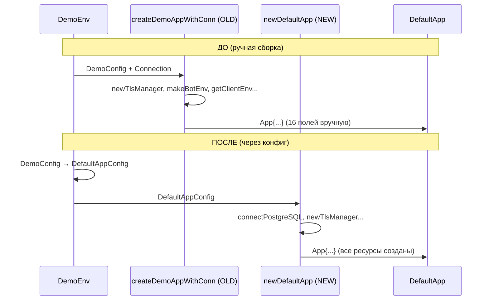
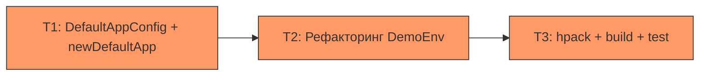

# План: DefaultAppConfig и смарт-конструктор newDefaultApp

**Дата**: 2026-04-23

---

# 🎯 ЦЕЛЬ

Добавить параметризованный конфигурационный тип `DefaultAppConfig serviceLib` и смарт-конструктор `newDefaultApp :: DefaultAppConfig serviceLib -> IO (DefaultApp serviceLib)` в модуль `LazyCircus.App.Default`, чтобы потребитель библиотеки мог создать полностью инициализированное приложение из сырых данных, не manually создавая очереди, генерируя JWK, подключаясь к БД и т.д.

**Критерий выполнения цели:**
- `DefaultAppConfig serviceLib` определён в `LazyCircus.App.Default` со всеми сырыми полями
- `newDefaultApp` создаёт `DefaultApp serviceLib` из конфига, выполняя все IO-действия (connectPostgreSQL, newTlsManager, makeBotEnv, genJWK, newTQueueIO, mkDefaultProcessContext, getClientEnv/makeMethods)
- `DemoEnv.hs` рефакторится для использования `DefaultAppConfig` + `newDefaultApp` вместо ручной сборки `App{...}`
- `hpack && stack build && stack test` проходят

---

# ❓ ДОПУЩЕНИЯ И ОТКРЫТЫЕ ВОПРОСЫ

**Допущения:**
- 🟢 `pgDbConnection` и `appMainDb` всегда получают одно и то же соединение (текущий паттерн из `DemoEnv`)
- 🟢 `logContext` всегда инициализируется как `mempty` — не конфигурируется
- 🟢 `logFunc` всегда пишет в stdout — не конфигурируется
- 🟢 `genLogFunc` всегда пишет в `logQueue` — не конфигурируется
- 🟡 Потребитель сам управляет lifecycle соединений (close) через bracket в `withDemoApp` или аналогичный wrapper; `newDefaultApp` не закрывает соединения при частичном сбое
- 🟢 `getClientEnv`/`makeMethods` доступны из зависимости `openai` (уже в `package.yaml`)

**Открытые вопросы:**
1. Нужна ли bracket-обёртка `withDefaultApp :: DefaultAppConfig serviceLib -> (DefaultApp serviceLib -> IO a) -> IO a` с автоматическим закрытием ресурсов? (Сейчас не добавляем, можно добавить отдельно.)
2. Нужно ли скрыть конструктор `App` (сделать его неэкспортируемым), чтобы заставить всех ходить через `newDefaultApp`? (Сейчас не скрываем — `LogSpec` использует прямой конструктор.)

---

# 🎨 ДИЗАЙН ИЗМЕНЕНИЙ

## Классификация полей DefaultApp

```
┌─────────────────────────────┬────────────────────┬──────────────────────────────┐
│ Поле DefaultApp             │ Источник           │ Кто создаёт                  │
├─────────────────────────────┼────────────────────┼──────────────────────────────┤
│ logFunc                     │ Infrastructure     │ newDefaultApp (mkLogFunc)    │
│ genLogFunc                  │ Infrastructure     │ newDefaultApp (mkGLogFunc)   │
│ pgDbConnection              │ Derived from raw   │ newDefaultApp (connectPG)    │
│ pgDbConnectionReadOnly      │ Derived from raw   │ newDefaultApp (traverse)     │
│ appMainDb                   │ = pgDbConnection   │ newDefaultApp (same conn)    │
│ appProcessContext           │ Infrastructure     │ newDefaultApp (mkDefProcCtx) │
│ botEnvs                     │ Derived from raw   │ newDefaultApp (makeBotEnv)   │
│ jwtSettings                 │ Derived (genJWK)   │ newDefaultApp (genJWK)       │
│ logQueue                    │ Infrastructure     │ newDefaultApp (newTQueueIO)  │
│ extraContext                │ ← RAW DATA         │ из DefaultAppConfig          │
│ logContext                  │ Initial state      │ newDefaultApp (mempty)       │
│ mailCreds                   │ ← RAW DATA         │ из DefaultAppConfig          │
│ asyncTasks                  │ Infrastructure     │ newDefaultApp (newTQueueIO)  │
│ aiMethods                   │ Derived from raw   │ newDefaultApp (makeMethods)  │
│ sqlLogAction                │ ← RAW DATA         │ из DefaultAppConfig          │
│ serviceLib                  │ ← RAW DATA         │ из DefaultAppConfig          │
└─────────────────────────────┴────────────────────┴──────────────────────────────┘
```

## Диаграмма потока сборки

```mermaid
graph TD
    subgraph "DefaultAppConfig (сырые данные)"
        CS["cfgPgConnectionString"]
        CSR["cfgPgConnectionStringReadOnly"]
        BC["cfgBotConfigs"]
        AIK["cfgAiApiKey / cfgAiBaseUrl"]
        MC["cfgMailCreds"]
        EC["cfgExtraContext"]
        SL["cfgServiceLib"]
        SQL["cfgSqlLogAction"]
    end

    subgraph "newDefaultApp (IO-действия)"
        PG["connectPostgreSQL"]
        PGRO["traverse connectPostgreSQL"]
        MGR["newTlsManager"]
        BE["makeBotEnv × N"]
        AIC["getClientEnv + makeMethods"]
        JWT["genJWK + defaultJWTSettings"]
        LQ["newTQueueIO × 2"]
        PCX["mkDefaultProcessContext"]
        LF["mkLogFunc + mkGLogFunc"]
    end

    subgraph "DefaultApp (результат)"
        APP["App { ... }"]
    end

    CS --> PG --> APP
    CSR --> PGRO --> APP
    MGR --> BE
    BC --> BE --> APP
    AIK --> AIC --> APP
    JWT --> APP
    LQ --> APP
    PCX --> APP
    LF --> APP

    MC --> APP
    EC --> APP
    SL --> APP
    SQL --> APP
```



## Схема взаимодействия (до/после)



---

# ⚖️ АЛЬТЕРНАТИВЫ

| Подход | Плюсы | Минусы | Вердикт |
|--------|-------|---------|---------|
| **A. Config-тип + smart constructor** (этот план) | Единая точка входа; повторяемая логика; потребитель не знает про внутренние ресурсы | Добавляет зависимость `jose` в library; больший модуль `App.Default` | ✅ Выбран |
| **B. Builder-паттерн (DefaultAppBuilder)** | Пошаговая конфигурация; может валидировать на каждом шаге | Сложнее; overkill для текущего числа полей; нет clear advantage над record | ❌ Отклонён |
| **C. Config-тип + отложенная инициализация (lazy IO)** | Не нужна IO в конструкторе; `unsafePerformIO` для ресурсов | Нарушает referential transparency; труднее тестировать; ошибки проявляются позже | ❌ Отклонён |

---

# 📋 ЗАДАЧИ

#### Задача T1: Добавить `DefaultAppConfig` и `newDefaultApp` в `App/Default.hs`
- **Описание**: Определить конфигурационный тип `DefaultAppConfig serviceLib` со всеми сырыми полями. Реализовать смарт-конструктор `newDefaultApp`, который выполняет все IO-действия (подключение к БД, создание TLS-менеджера, инициализацию bot envs, генерацию JWT, создание очередей и т.д.) и возвращает полностью собранный `DefaultApp serviceLib`.
- **Файлы для просмотра**:
  - `src/LazyCircus/App/Default.hs` — текущее определение `DefaultApp`, все `Has*`-инстансы, импорты; нужно понять что уже импортируется
  - `common/DemoEnv.hs` — текущая реализация `createDemoAppWithConn`; это "референс" для `newDefaultApp`
  - `package.yaml` — зависимости library; нужно добавить `jose`
- **Правки**:
  - В `package.yaml`: добавить `jose` в список `dependencies` (после `crypton-x509-store`, строка ~49)
  - В `src/LazyCircus/App/Default.hs`:
    - Добавить импорты:
      - `Crypto.JOSE (KeyMaterialGenParam (OctGenParam), genJWK)`
      - `Database.PostgreSQL.Simple (Connection, connectPostgreSQL)` — расширить существующий импорт
      - `LazyCircus.Telegram (makeBotEnv)` — для создания bot envs
      - `Network.HTTP.Client.TLS (newTlsManager)` — для TLS-менеджера
      - `OpenAI.V1 (getClientEnv, makeMethods)` — для AI-клиента
      - `RIO.Process (mkDefaultProcessContext)` — для process context
      - `Servant.Auth.Server (defaultJWTSettings)` — расширить существующий импорт
    - Добавить `DefaultAppConfig` data type (после `MailCreds`, перед `DefaultApp`):
      ```haskell
      -- | Raw configuration values needed to construct a fully initialized DefaultApp.
      -- The smart constructor 'newDefaultApp' reads these values and performs all
      -- necessary IO (connecting to databases, creating queues, initializing bot
      -- environments, generating JWT keys) to produce a ready-to-use DefaultApp.
      data DefaultAppConfig serviceLib = DefaultAppConfig
          { cfgPgConnectionString :: !ByteString
          -- ^ PostgreSQL connection string for the primary read-write database
          , cfgPgConnectionStringReadOnly :: !(Maybe ByteString)
          -- ^ optional PostgreSQL connection string for a read-only replica
          , cfgBotConfigs :: ![(Text, Text)]
          -- ^ (botName, botToken) pairs for Telegram bots to initialize
          , cfgAiApiKey :: !(Maybe Text)
          -- ^ OpenAI-compatible API key; when Nothing, a dummy client is created
          , cfgAiBaseUrl :: !(Maybe Text)
          -- ^ OpenAI-compatible base URL; defaults to "https://api.deepseek.com"
          , cfgMailCreds :: !MailCreds
          -- ^ SMTP credentials for outgoing mail
          , cfgExtraContext :: !ExtraContext
          -- ^ arbitrary key-value configuration exposed to flows
          , cfgSqlLogAction :: !(Maybe (String -> IO ()))
          -- ^ optional SQL query tracer; defaults to putStrLn when Nothing
          , cfgServiceLib :: !serviceLib
          -- ^ collection of in-process service handlers
          }
      ```
    - Добавить `newDefaultApp` (после `DefaultApp`, перед `HasLogFunc` instance):
      ```haskell
      {- | Construct a fully initialized DefaultApp from raw configuration values.
      Connects to PostgreSQL, initializes Telegram bot environments, creates the
      AI client, generates JWT settings, and sets up all internal queues.
      PRE-CONTRACT: cfgPgConnectionString points to a reachable PostgreSQL instance
      with the expected schema already migrated.
      POST-CONTRACT: Returns a DefaultApp with live connections and initialized
      resources. The caller is responsible for closing connections via bracket or
      similar cleanup mechanism.
      -}
      newDefaultApp :: DefaultAppConfig serviceLib -> IO (DefaultApp serviceLib)
      newDefaultApp config = do
          conn <- connectPostgreSQL (cfgPgConnectionString config)
          mReadOnlyConn <- traverse connectPostgreSQL (cfgPgConnectionStringReadOnly config)
          manager <- newTlsManager
          botEnvsVal <- fmap M.fromList $ forM (cfgBotConfigs config) $ \(name, tokenText) -> do
              botEnv <- makeBotEnv manager (Token tokenText, name)
              pure (name, botEnv)
          aiMethodsVal <- case cfgAiApiKey config of
              Just apiKey -> do
                  let baseUrl = fromMaybe "https://api.deepseek.com" (cfgAiBaseUrl config)
                  ce <- getClientEnv baseUrl
                  pure $ makeMethods ce apiKey Nothing Nothing
              Nothing -> do
                  ce <- getClientEnv "https://example.com"
                  pure $ makeMethods ce "dummy-key" Nothing Nothing
          jwk <- genJWK (OctGenParam 256)
          let jwtSettingsVal = defaultJWTSettings jwk
          logQueueVal <- newTQueueIO
          asyncTasksVal <- newTQueueIO
          processCtx <- mkDefaultProcessContext
          let logFuncVal = mkLogFunc $ \_cs _src _lvl msg ->
                  hPutBuilder stdout (getUtf8Builder msg)
          let genLogFuncVal = mkGLogFunc $ \_cs msg ->
                  atomically $ writeTQueue logQueueVal msg
          let sqlLog = fromMaybe putStrLn (cfgSqlLogAction config)
          pure App
              { logFunc = logFuncVal
              , genLogFunc = genLogFuncVal
              , pgDbConnection = conn
              , pgDbConnectionReadOnly = mReadOnlyConn
              , appMainDb = conn
              , appProcessContext = processCtx
              , botEnvs = botEnvsVal
              , jwtSettings = jwtSettingsVal
              , logQueue = logQueueVal
              , extraContext = cfgExtraContext config
              , logContext = mempty
              , mailCreds = cfgMailCreds config
              , asyncTasks = asyncTasksVal
              , aiMethods = aiMethodsVal
              , sqlLogAction = sqlLog
              , serviceLib = cfgServiceLib config
              }
      ```
    - Обновить export list модуля (добавить `DefaultAppConfig(..)` и `newDefaultApp`)
- **Ловушки и подводные камни**:
  - ⚠️ **Циклический импорт**: `LazyCircus.App.Default` будет импортировать `LazyCircus.Telegram`. Проверено: `LazyCircus.Telegram` не импортирует `LazyCircus.App.Default` (только `LazyCircus.App.Log` и `LazyCircus.Telegram.Types`). Цикла нет.
  - ⚠️ **`jose` не в deps library**: Пакет `jose` есть в deps executables/common-circus, но **отсутствует** в deps library. Нужно добавить в `package.yaml`.
  - ⚠️ **Тип `Connection`**: В `App/Default.hs` импортирован `Database.PostgreSQL.Simple (Connection)`. Нужно расширить до `Database.PostgreSQL.Simple (Connection, connectPostgreSQL)`.
  - ⚠️ **`fromMaybe` для AI base URL**: Нужен импорт `fromMaybe` — уже доступен через `RIO`.
- **Критерий выполнения**: Модуль `LazyCircus.App.Default` компилируется и экспортирует `DefaultAppConfig(..)` и `newDefaultApp`
- **Зависимости**: нет
- **Группа параллелизма**: —
- **Сложность / Риск / Ценность**: Medium / 🟡 / 🔴

---

#### Задача T2: Рефакторинг `DemoEnv.hs` для использования `DefaultAppConfig` + `newDefaultApp`
- **Описание**: Переписать `DemoEnv.hs` так, чтобы вместо ручной сборки `App{...}` в `createDemoAppWithConn` использовался `DefaultAppConfig` и `newDefaultApp`. Разделить `setupDatabase` на setup-only (без возврата `Connection`) и передачу connection string в конфиг. Обновить `withDemoApp`.
- **Файлы для просмотра**:
  - `common/DemoEnv.hs` — весь файл; основная логика создания `DefaultApp`
  - `test/BotScenariosSpec.hs` — использует `withDemoApp`; проверить что интерфейс `withDemoApp` не ломается
  - `test/LogSpec.hs` — использует прямой конструктор `App{...}`; НЕ затрагивается
- **Правки**:
  - В `common/DemoEnv.hs`:
    - Удалить `createDemoAppWithConn` (или переписать как обёртку над `newDefaultApp`)
    - Добавить функцию-конвертер `demoConfigToAppConfig :: DemoConfig -> DefaultAppConfig NoServiceLib`
    - Упростить `setupDatabase` — убрать последний `retryConnect testConnectionString` (соединение создаёт `newDefaultApp`); изменить тип с `IO Connection` на `IO ()`
    - Переписать `withDemoApp`:
      ```haskell
      withDemoApp :: DemoConfig -> (DefaultApp NoServiceLib -> IO ()) -> IO ()
      withDemoApp cfg action = do
          setupDatabase  -- только create/migrate, без возврата Connection
          let appConfig = demoConfigToAppConfig cfg
          app <- newDefaultApp appConfig
          bracket
              ( do
                  logThread <- async $ runRIO (logAppFromDefaultApp app) logWorker
                  asyncThread <- async $ runRIO app (runAsyncWorker (runDefaultPerformer . runDefaultScenario))
                  pure (app, logThread, asyncThread)
              )
              ( \(_, logThread, asyncThread) -> do
                  cancel asyncThread
                  cancel logThread
              )
              (action . fst3)
      ```
    - Убрать ставшие ненужными импорты (`newTlsManager`, `getClientEnv`, `makeMethods`, `genJWK`, `OctGenParam`, `defaultJWTSettings`)
- **Ловушки и подводные камни**:
  - ⚠️ **`setupDatabase` меняет тип**: Если убрать `retryConnect testConnectionString`, тип меняется с `IO Connection` на `IO ()`. Все вызовы `setupDatabase` должны быть обновлены.
  - ⚠️ **`cfgNotificationEmail` и `cfgTgChatId`**: Эти поля из `DemoConfig` НЕ входят в `DefaultAppConfig`. Они используются в бизнес-логике демо-приложения. Конвертер `demoConfigToAppConfig` их игнорирует — это нормально.
  - ⚠️ **`LogSpec`**: Этот тест использует прямой конструктор `App{...}` с `unsafeCoerce` и НЕ должен меняться. Проверить что тесты LogSpec по-прежнему компилируются.
- **Критерий выполнения**: `DemoEnv.hs` компилируется, `BotScenariosSpec` проходит без изменений, `LogSpec` компилируется и проходит
- **Зависимости**: T1
- **Группа параллелизма**: —
- **Сложность / Риск / Ценность**: Medium / 🟡 / 🔴

---

#### Задача T3: Верификация — hpack + build + test
- **Описание**: Запустить `hpack`, затем `stack build`, затем `stack test` и убедиться что всё компилируется и тесты проходят.
- **Файлы для просмотра**:
  - `package.yaml` — проверить что `jose` добавлен
  - `lazy-circus.cabal` (генерируемый) — проверить что `DefaultAppConfig(..)` и `newDefaultApp` в export list
- **Правки**: Нет правок — только верификация. При необходимости — исправить ошибки компиляции.
- **Ловушки и подводные камни**:
  - ⚠️ Если `hpack` не запущен перед `stack build`, cabal-файл будет устаревшим
  - ⚠️ `-Wmissing-export-lists` может ругнуться если `DefaultAppConfig(..)` не в export list модуля
- **Критерий выполнения**: `hpack && stack build` завершается без ошибок; `stack test` завершается без ошибок
- **Зависимости**: T1, T2
- **Группа параллелизма**: —
- **Сложность / Риск / Ценность**: Low / 🟢 / 🔴

---

# 🗺️ ПЛАН ВЫПОЛНЕНИЯ



**Критический путь**: T1 → T2 → T3

**Рекомендуемый порядок**:
1. **T1** — самая рискованная задача (новые импорты, возможные circular deps, новый dep). Начать с неё.
2. **T2** — зависит от T1, но меняет только consumer-код. Можно делать сразу после компиляции T1.
3. **T3** — финальная верификация.
