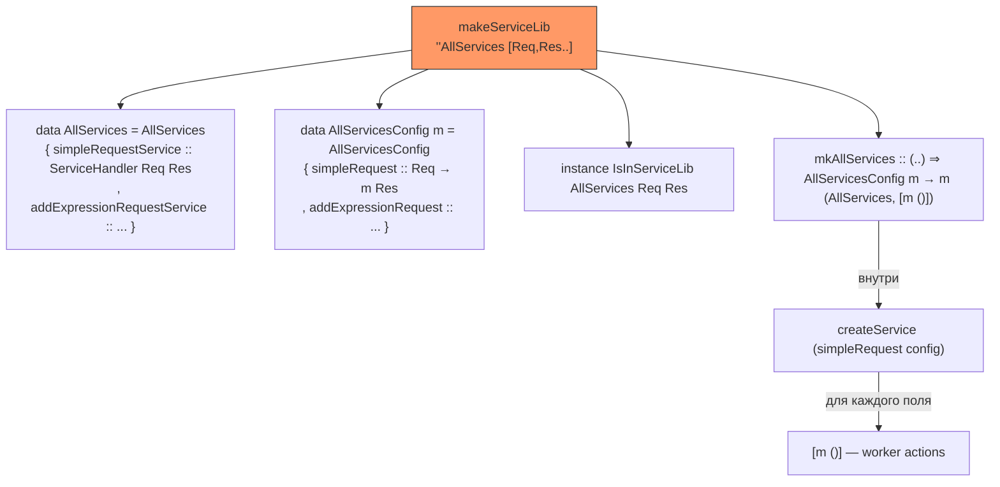
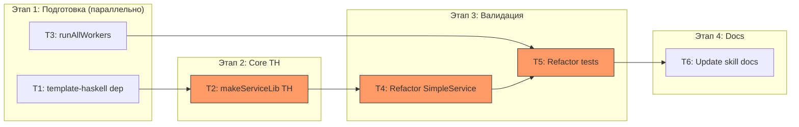

# Plan: ServiceLib TemplateHaskell Generation

## 🎯 ЦЕЛЬ

TH-макрос `makeServiceLib` принимает имя типа и список пар `(''RequestType, ''ResponseType)`, и генерирует:
1. Записный тип `serviceLib` с полями `ServiceHandler req res`
2. Конфигурационный записный тип `{Name}Config m` с полями `req -> m res` для размещения обработчиков
3. Инстансы `IsInServiceLib` для каждой пары
4. Функцию-раннер `mk{Name} :: config -> m (serviceLib, [m ()])`

Пользователь заполняет конфиг любыми обработчиками (каррированными, с любыми constraint'ами) и вызывает `mkAllServices config` → получает готовый serviceLib + список воркеров.

**Критерий выполнения**: `makeServiceLib "AllServices" [(''SimpleRequest, ''SimpleResponse), (''AddExpressionRequest, ''AddExpressionResponse)]` генерирует тип, конфиг, инстансы и билдер; тест `ServiceCallSpec` проходит через сгенерированный код.

---

## ❓ ДОПУЩЕНИЯ И ОТКРЫТЫЕ ВОПРОСЫ

### Допущения
- 🟢 `HasFailbackValue res` инстансы определяются пользователем вручную — TH только добавляет constraint в сигнатуру `mk{Name}`
- 🟢 Пары `(RequestType, ResponseType)` уникальны — TH детектит дубликаты и выдаёт `fail`
- 🟢 Field names генерируются из имён типов запросов: `SimpleRequest` → `simpleRequest` (config), `simpleRequestService` (serviceLib)

### Решённые вопросы
1. Field name convention: `{requestTypeNameLower}` для конфига, `{requestTypeNameLower}Service` для serviceLib — ✅ утверждено
2. `runAllWorkers`: `MonadUnliftIO m => [m ()] -> m ()` через `mapM_ (void . async)` — ✅ утверждено

---

## 🎨 ДИЗАЙН ИЗМЕНЕНИЙ

### API: что пишет пользователь

```haskell
{-# LANGUAGE TemplateHaskell #-}

-- 1. Типы запросов/ответов (определяет пользователь)
data SimpleRequest = Add Int Int | Subtract Int Int
data SimpleResponse = SimpleResult Int deriving (Show, Eq)
data AddExpressionRequest = AddExpressionRequest Text deriving (Show, Eq)
data AddExpressionResponse = AddExpressionResult Text deriving (Show, Eq)

-- 2. TH-сплайн — генерирует всё
makeServiceLib "AllServices"
  [ (''SimpleRequest, ''SimpleResponse)
  , (''AddExpressionRequest, ''AddExpressionResponse)
  ]

-- 3. Обработчики — любые, хоть каррированные
handleSimple :: (MonadIO m) => SimpleRequest -> m SimpleResponse
handleSimple (Add x y)      = pure $ SimpleResult (x + y)
handleSimple (Subtract x y) = pure $ SimpleResult (x - y)

handleExpr :: (MonadIO m) => AddExpressionRequest -> m AddExpressionResponse
handleExpr (AddExpressionRequest e) = pure $ AddExpressionResult (e <> "!")

-- HasFailbackValue — вручную
instance HasFailbackValue SimpleResponse where
    failbackValue = SimpleResult 0
instance HasFailbackValue AddExpressionResponse where
    failbackValue = AddExpressionResult ""

-- 4. Использование
main :: IO ()
main = do
    let config = AllServicesConfig
          { simpleRequest = handleSimple
          , addExpressionRequest = handleExpr
          }
    (services, workers) <- mkAllServices config
    runAllWorkers workers
    app <- newDefaultApp DefaultAppConfig{ cfgServiceLib = services, ... }
    ...
```

### Что генерирует TH



---

## ⚖️ АЛЬТЕРНАТИВЫ

| Подход | Плюсы | Минусы | Вердикт |
|--------|-------|---------|---------|
| **TH с парами типов + config record** | Явные типы; обработчики произвольные; type-safe конфигурация | Зависимость от TH | ✅ Выбран |
| TH с reify типов обработчиков | Меньше аргументов | Не работает с каррированными обработчиками; хрупкий type decomposition | ❌ Отклонён |
| Ручной бойлерплейт | Без TH | 4×N строк на каждый сервис | ❌ Отклонён |

---

## 📋 ЗАДАЧИ

### Задача T1: Добавить `template-haskell` в зависимости
- **Описание**: Добавить `template-haskell` в зависимости `package.yaml`
- **Файлы для просмотра**:
  - `package.yaml` — текущий список `dependencies`
- **Правки**:
  - В файле `package.yaml`: добавить `template-haskell` в секцию `dependencies`
- **Ловушки и подводные камни**:
  - ⚠️ `template-haskell` — boot library, но лучше указать явно для прозрачности
- **Критерий выполнения**: `hpack && stack build` компилируется без ошибок
- **Зависимости**: нет
- **Сложность / Риск / Ценность**: Low / 🟢 / 🟡
- **Группа параллелизма**: `wt-2`

---

### Задача T2: Создать модуль `LazyCircus.App.Service.TH` с `makeServiceLib`
- **Описание**: Создать TH-макрос, который по имени типа и списку пар `(''Req, ''Res)` генерирует: data-тип serviceLib, data-тип config с параметром `m`, инстансы `IsInServiceLib`, функцию-раннер `mk{Name}`.
- **Файлы для просмотра**:
  - `src/LazyCircus/App/Service.hs` — типы `ServiceHandler`, `IsInServiceLib`, `callService`, `HasFailbackValue`, `createService`, `Pipe`
  - `common/SimpleService.hs` — пример ручного `AllServices`, `IsInServiceLib` инстансов (понять что генерировать)
- **Правки**:
  - Создать `src/LazyCircus/App/Service/TH.hs`
  - Реализовать следующие внутренние хелперы и публичный макрос:

  **Хелперы:**

  1. `typeToFieldName :: Name -> String` — берёт `nameBase`, lowercase'ит первый символ. `SimpleRequest` → `"simpleRequest"`
  2. `detectDuplicates :: [(Type, Type)] -> Q ()` — проверяет уникальность пар `(req, res)` через `Show`; при дубле — `fail` с понятным сообщением
  3. `genServiceLibType :: String -> [(String, Type, Type)] -> Q Dec` — генерирует `data AllServices = AllServices { simpleRequestService :: ServiceHandler SimpleRequest SimpleResponse, ... }`. Field names: `{fieldName}Service`
  4. `genConfigType :: String -> [(String, Type, Type)] -> Q Dec` — генерирует `data AllServicesConfig m = AllServicesConfig { simpleRequest :: SimpleRequest -> m SimpleResponse, ... }`. Field names: `{fieldName}`. Тип `m` — свежая переменная (через `newName`)
  5. `genIsInServiceLibInstances :: Name -> [(String, Name, Name)] -> [Q Dec]` — для каждой пары `(fieldName, reqName, resName)` генерирует:
     ```haskell
     instance IsInServiceLib AllServices SimpleRequest SimpleResponse where
       callFromServiceLib = callService . simpleRequestService
     ```
     Использует `ConT reqName` и `ConT resName` для типов
  6. `genMkFunction :: String -> Name -> [(String, Name, Name)] -> Q Dec` — генерирует:
     ```haskell
     mkAllServices :: forall m. (MonadUnliftIO m, HasFailbackValue Res1, HasFailbackValue Res2)
                   => AllServicesConfig m -> m (AllServices, [m ()])
     mkAllServices config = do
       (h0, w0) <- createService (simpleRequest config)
       (h1, w1) <- createService (addExpressionRequest config)
       pure (AllServices h0 h1, [w0, w1])
     ```
     Constraints: `MonadUnliftIO m` + `HasFailbackValue` для каждого `resName`. Тело: `createService` для каждого поля конфига, сборка через `AllServices` конструктор

  **Публичный API:**

  7. `makeServiceLib :: String -> [(Name, Name)] -> Q [Dec]` — точка входа:
     - Для каждой пары `(reqName, resName)`:
       - Вычислить `fieldName = typeToFieldName reqName`
       - Валидировать что `reqName` и `resName` ссылаются на type constructors
     - Вызвать `detectDuplicates`
     - Собрать результаты `genServiceLibType`, `genConfigType`, `genIsInServiceLibInstances`, `genMkFunction`
     - Вернуть `[Dec]`

  **Экспорты модуля**: `makeServiceLib`

- **Ловушки и подводные камни**:
  - ⚠️ Config field names collide с ServiceLib field names если не добавлять суффикс. Config: `simpleRequest`, ServiceLib: `simpleRequestService` — ок, разные имена
  - ⚠️ `IsInServiceLib` — multi-param typeclass. Инстанс `callFromServiceLib = callService . simpleRequestService` компилируется без расширений: типы `req`/`res` фиксируются типом поля записи
  - ⚠️ `StrictData` в default-extensions. Генерируемый тип будет строгим — норм для `ServiceHandler` (все поля WHNF)
  - ⚠️ `forall m.` в сигнатуре `mkAllServices` — нужно явно генерировать `ForallT` или `SigD` с `ForallC`. GHC требует explicit forall когда есть scoped type variables
  - ⚠️ `HasFailbackValue res` constraint: `res` — конкретный тип (`ConT resName`), не переменная. В TH: `AppT (ConT ''HasFailbackValue) (ConT resName)`
  - ⚠️ Порядок constraints: `MonadUnliftIO m` первым, затем все `HasFailbackValue`
  - ⚠️ Имя типа конфига: `{typeName}Config`. Имя функции: `mk{typeName}`. Оба имени должны быть валидными Haskell идентификаторами
- **Критерий выполнения**: Модуль компилируется; `makeServiceLib "TestSL" [(''SimpleRequest, ''SimpleResponse)]` генерирует корректные 4+ декларации (проверить через `-ddump-splices` или тестовый модуль)
- **Зависимости**: T1
- **Сложность / Риск / Ценность**: High / 🔴 / 🔴
- **Группа параллелизма**: `wt-1`

---

### Задача T3: Добавить `runAllWorkers` в `LazyCircus.App.Service`
- **Описание**: Добавить helper, который принимает список worker-действий и запускает их через `async`
- **Файлы для просмотра**:
  - `src/LazyCircus/App/Service.hs` — текущий экспорт-лист
- **Правки**:
  - В файле `src/LazyCircus/App/Service.hs`: добавить и экспортировать `runAllWorkers`
  - Определение:
    ```haskell
    -- | Fork all worker actions as concurrent threads.
    -- PRE-CONTRACT: Worker list is non-empty.
    -- POST-CONTRACT: All workers are running asynchronously.
    runAllWorkers :: (MonadUnliftIO m) => [m ()] -> m ()
    runAllWorkers = mapM_ (void . async)
    ```
- **Ловушки и подводные камни**:
  - ⚠️ `async` нужен `MonadUnliftIO` — это уже покрывается constraint'ом
  - ⚠️ Worker'ы — бесконечные циклы. `void . async` — fire-and-forget. Для graceful shutdown пользователь может обернуть в `withAsync` или `bracket` самостоятельно
- **Критерий выполнения**: `runAllWorkers [worker1, worker2]` компилируется; оба воркера запускаются параллельно
- **Зависимости**: нет
- **Сложность / Риск / Ценность**: Low / 🟢 / 🟡
- **Группа параллелизма**: `wt-2`

---

### Задача T4: Рефакторинг `common/SimpleService.hs` на TH
- **Описание**: Заменить ручное определение `AllServices`, инстансы `IsInServiceLib` и helper-типы на вызов `makeServiceLib`. Оставить типы запросов/ответов, `HasFailbackValue` инстансы и обработчики.
- **Файлы для просмотра**:
  - `common/SimpleService.hs` — весь файл
- **Правки**:
  - Добавить `{-# LANGUAGE TemplateHaskell #-}`
  - Добавить `import LazyCircus.App.Service.TH (makeServiceLib)`
  - Удалить: ручное `data AllServices`, ручные `IsInServiceLib` инстансы, `AllServiceHandlers`, `AllResponses`
  - Добавить:
    ```haskell
    makeServiceLib "AllServices"
      [ (''SimpleRequest, ''SimpleResponse)
      , (''AddExpressionRequest, ''AddExpressionResponse)
      ]
    ```
  - Оставить: `SimpleRequest`, `SimpleResponse`, `AddExpressionRequest`, `AddExpressionResponse`, `HasFailbackValue` инстансы, `handleSimpleRequest`, `handleAddExpressionRequest`
- **Ловушки и подводные камни**:
  - ⚠️ TH-splice должен быть после определения типов `SimpleRequest`/`SimpleResponse`/etc., т.к. `''SimpleRequest` ссылается на них
  - ⚠️ `common-circus` internal library зависит от `lazy-circus` — доступ к TH модулю есть
  - ⚠️ После рефакторинга имена полей изменятся: было `addService`/`addExpressionService`, станет `simpleRequestService`/`addExpressionRequestService`. Нужно обновить все ссылки
- **Критерий выполнения**: `hpack && stack build` компилируется; модуль экспортирует `AllServices`, `AllServicesConfig`, `mkAllServices`, `simpleRequestService`, `addExpressionRequestService`
- **Зависимости**: T2
- **Сложность / Риск / Ценность**: Medium / 🟡 / 🔴
- **Группа параллелизма**: `wt-1`

---

### Задача T5: Рефакторинг `test/ServiceCallSpec.hs` на сгенерированный код
- **Описание**: Заменить ручной `createAllServices` на `mkAllServices config` + `runAllWorkers`. Адаптировать cleanup.
- **Файлы для просмотра**:
  - `test/ServiceCallSpec.hs` — текущая реализация `createAllServices` и `withServiceTestApp`
- **Правки**:
  - В файле `test/ServiceCallSpec.hs`:
    - Удалить `createAllServices`
    - В `withServiceTestApp`: заменить на:
      ```haskell
      let config = AllServicesConfig
            { simpleRequest = handleSimpleRequest
            , addExpressionRequest = handleAddExpressionRequest
            }
      (allServices, workers) <- mkAllServices config
      ```
    - Worker запуск: `runAllWorkers workers` (вместо ручных `forkIO`)
    - Cleanup: убрать `killThread` для worker'ов (они живут в фоне, умрут с процессом) или сохранить `ThreadId`'ы если нужен graceful shutdown
    - Обновить импорты: убрать `createService`, `forkIO`; добавить `mkAllServices`, `AllServicesConfig`, `runAllWorkers`
- **Ловушки и подводные камни**:
  - ⚠️ Текущий cleanup убивает ThreadIds: `mapM_ killThread tids`. Если `runAllWorkers` не возвращает ThreadIds, нужно изменить стратегию cleanup. Варианты: (а) не убивать, (б) не возвращать ThreadIds из `runAllWorkers`, (в) использовать `withAsync` вместо `async`
  - ⚠️ Тест использует `cfgServiceLib = allServices` — после рефакторинга `allServices` — первый элемент кортежа из `mkAllServices`
- **Критерий выполнения**: `stack test` — все 5 тестов в `ServiceCallSpec` проходят
- **Зависимости**: T3, T4
- **Сложность / Риск / Ценность**: Medium / 🟡 / 🔴
- **Группа параллелизма**: `wt-1`

---

### Задача T6: Обновить документацию skill
- **Описание**: Добавить в skill reference секцию про TH-макрос, config record, `runAllWorkers`
- **Файлы для просмотра**:
  - `docs/skills/lazy-circus/reference/extension.md`
- **Правки**:
  - Добавить секцию "Service Library via TemplateHaskell" с примером полного цикла
  - Добавить pitfalls: `HasFailbackValue` обязателен, типы до splice, нет дублирующих `(req, res)`
  - Обновить checklist
- **Критерий выполнения**: Документация содержит рабочий пример от `makeServiceLib` до `runAllWorkers`
- **Зависимости**: T5
- **Сложность / Риск / Ценность**: Low / 🟢 / 🟡
- **Группа параллелизма**: —

---

## 🗺️ ПЛАН ВЫПОЛНЕНИЯ



**Критический путь**: T1 → T2 → T4 → T5

**Рекомендуемый порядок**:
1. T1 + T3 параллельно (быстрые, независимые)
2. T2 — core, наивысший риск
3. T4 — валидация TH на реальном коде
4. T5 — end-to-end через тесты
5. T6 — документация
