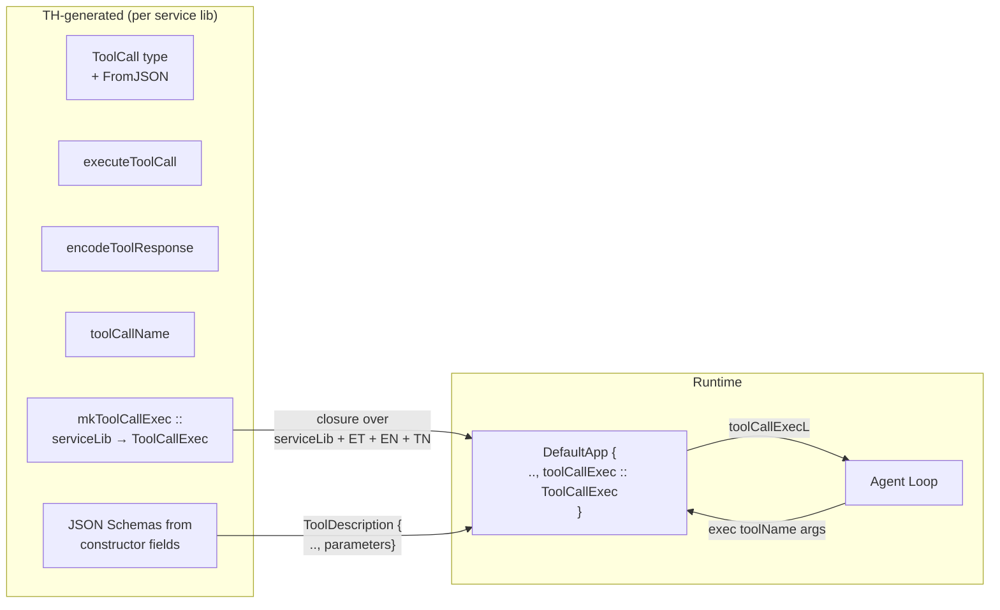
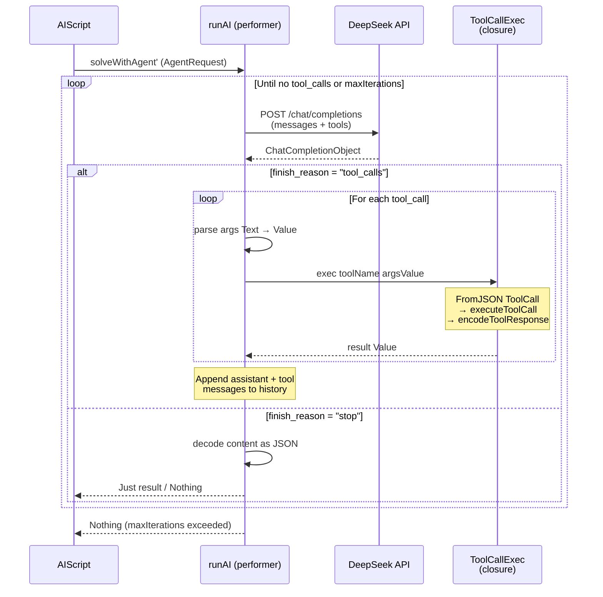
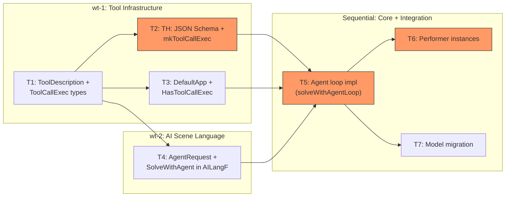

# Agent Loop (solveWithAgent) — Plan

Date: 2026-04-26
Updated: v2 — simplified (no OpenAI patching, no ToolDispatch class, TH-generated schemas)

## 1. 🎯 ЦЕЛЬ

Добавить в `AILangF` команду `solveWithAgent`, реализующую ReAct-агентный цикл поверх DeepSeek API с tool calls. Агент получает задачу, итеративно вызывает инструменты через service-lib, пока не сформирует итоговый ответ. Всё внутри AIScript.

**Критерий выполнения цели:**
- `solveWithAgent :: (FromJSON b) => AgentRequest b -> AIScript (Maybe b)` компилируется и доступен через фасад `LazyCircus.Scene.AI`
- `evalScript $ aiScriptWithAll $ solveWithAgent req` выполняет ReAct-цикл: DeepSeek → tool_calls → executeToolCall → результат обратно модели → финальный JSON → `Just result`
- `maxIterations` корректно обрывает цикл → `Nothing`
- Test performer возвращает `Nothing` без API-вызовов
- Существующий `ask` работает без изменений

---

## 2. ❓ ДОПУЩЕНИЯ И ОТКРЫТЫЕ ВОПРОСЫ

### Допущения

- 🟢 DeepSeek API поддерживает OpenAI-совместимый формат tool calls (подтверждено документацией)
- 🟢 Библиотека `openai` поддерживает `tools`, `tool_calls`, `ToolChoice` в типах (подтверждено чтением исходников)
- 🟢 `aeson` молча игнорирует неизвестные поля — `reasoning_content` в ответе DeepSeek парсится без ошибок
- 🟢 Используем `deepseek-v4-flash` в non-thinking режиме — модель не генерирует `reasoning_content`, проблем с мультираундом нет
- 🟢 TH может через `reify` достать поля record-конструкторов для генерации JSON Schema

### Открытые вопросы

_Нет_

---

## 3. 🎨 ДИЗАЙН ИЗМЕНЕНИЙ

### Как работает tool dispatch без type class



Ключевая идея: `ToolCallExec` — простое замыкание `Text → Value → IO Value`, созданное один раз при инициализации приложения. Замыкание захватывает конкретный `serviceLib` и TH-generated функции. Никаких type class.

### Последовательность агентного цикла



### Новые типы

```haskell
-- LazyCircus.AI
data AgentRequest a = AgentRequest
    { agentPrompt        :: [POML]
    , agentSystemPrompt  :: [POML]
    , agentMaxIterations :: Int
    }

-- LazyCircus.App.Service
newtype ToolCallExec = ToolCallExec
    { runToolCallExec :: Text -> Value -> IO Value
    -- ^ Замыкание: tool name → args JSON → result JSON
    -- Внутри: parse ToolCall, executeToolCall, encodeToolResponse
    }

class HasToolCallExec env where
    toolCallExecL :: Lens' env ToolCallExec

-- Расширение ToolDescription
data ToolDescription = ToolDescription
    { toolDescName        :: Text
    , toolDescDescription :: Text
    , toolDescParameters  :: Maybe Value  -- JSON Schema (TH-generated from record fields)
    }
```

### Затрагиваемые модули

| Слой | Модуль | Изменение |
|------|--------|-----------|
| Service | `LazyCircus.App.Service` | + `ToolCallExec`, `HasToolCallExec`, расширение `ToolDescription` |
| Service TH | `LazyCircus.App.Service.TH` | + генерация JSON Schema, + `mkToolCallExec` |
| AI Scene | `LazyCircus.Scene.AI.Lang` | + `SolveWithAgent` конструктор, + `solveWithAgent` smart ctor |
| AI Scene | `LazyCircus.Scene.AI.Class` | + `solveWithAgent'` в `AILangPerformer` (default = Nothing), обновление `runAI` |
| AI Scene | `LazyCircus.Scene.AI` | Ре-экспорт `solveWithAgent`, `AgentRequest` |
| AI Core | `LazyCircus.AI` | + `AgentRequest`, + `solveWithAgentLoop`, модель → `deepseek-v4-flash` |
| App Env | `LazyCircus.App.Default` | + `toolCallExec` field, `HasToolCallExec` instance |
| Performer | `LazyCircus.Performer.Default` | + `solveWithAgent'` impl, `HasToolCallExec` constraint |
| Testing | `LazyCircus.Testing.Performer` | + mock `ToolCallExec` |

---

## 4. ⚖️ АЛЬТЕРНАТИВЫ

### Как абстрагировать tool dispatch?

| Подход | Плюсы | Минусы | Вердикт |
|--------|-------|---------|---------|
| **`ToolCallExec` closure в env** (выбранный) | Нет type class; простая запись; TH генерит один раз; explicit | Нужно поле в DefaultApp + setup | ✅ Выбран |
| `ToolDispatch` type class | Полиморфизм; чистая абстракция | Новый type class + associated types; constraint propagation через все instances | ❌ Избыточно |
| Raw JSON dispatch (`Value → Value`) | Максимальная простота | Теряем type safety; нет compile-time validation | ❌ Отклонён |

### JSON Schema для параметров инструментов

| Подход | Плюсы | Минусы | Вердикт |
|--------|-------|---------|---------|
| **TH auto-gen из record полей** (выбранный) | Автоматический; zero boilerplate для record types | Не работает для non-record constructors (fallback на generic) | ✅ Выбран |
| Ручное указание в spec | Полный контроль | Дублирование; ручной труд | ❌ Отклонён (можно добавить потом как override) |

---

## 5. 📋 ЗАДАЧИ

### Задача T1: Расширить `ToolDescription` + добавить `ToolCallExec` в Service
- **Описание**: Добавить `toolDescParameters :: Maybe Value` в `ToolDescription`. Определить `ToolCallExec` newtype и `HasToolCallExec` class.
- **Файлы для просмотра**:
  - `src/LazyCircus/App/Service.hs` — `ToolDescription` (строка ~147), место для `ToolCallExec` и `HasToolCallExec`
- **Правки**:
  - В `ToolDescription`: добавить `toolDescParameters :: Maybe Value`
  - Добавить:
    ```haskell
    -- | Closure that dispatches a named tool call with JSON arguments.
    newtype ToolCallExec = ToolCallExec
        { runToolCallExec :: Text -> Value -> IO Value
        }
    
    -- | Environment capability for tool execution.
    class HasToolCallExec env where
        toolCallExecL :: Lens' env ToolCallExec
    ```
- **Ловушки и подводные камни**:
  - ⚠️ `Value` из aeson имеет `Show`/`Eq` — deriving `ToolDescription` не сломается. Но `ToolCallExec` не может derive `Show`/`Eq` — нужно `deriving anyclass` или вручную (или не deriving)
- **Критерий выполнения**: `ToolDescription` компилируется с новым полем. `ToolCallExec` и `HasToolCallExec` доступны из `LazyCircus.App.Service`
- **Зависимости**: нет
- **Группа параллелизма**: `wt-1`
- **Сложность / Риск / Ценность**: Low / 🟢 / 🔴

---

### Задача T2: TH: генерация JSON Schema + `mkToolCallExec`
- **Описание**: Расширить TH для: (a) генерации JSON Schema из record-полей конструкторов, (b) генерации `mkToolCallExec :: serviceLib -> ToolCallExec` которая создаёт замыкание с dispatch.
- **Файлы для просмотра**:
  - `src/LazyCircus/App/Service/TH.hs` — `makeServiceLib`, `genToolInfo`, `genToolCallType`, `genExecuteToolCall`, `genToolCallName`, `genEncodeToolResponse`
- **Правки**:
  - **JSON Schema**: добавить генератор `genToolSchema :: Name -> [(Name, String, String)] -> Q [Dec]`:
    - Для каждого spec: `reify` parent type → найти конструктор → извлечь поля
    - Если record constructor: сгенерить JSON Schema с именами полей + маппинг типов Haskell → JSON Schema (`Int` → `"integer"`, `Text` → `"string"`, `Double` → `"number"`, `Bool` → `"boolean"`)
    - Если non-record constructor: schema = `Nothing`
    - Результат: функция `toolSchema :: {Lib}Tool -> Maybe Value`
  - **Обновить `genToolInfo`**: включить `toolDescParameters = toolSchema tool`
  - **`mkToolCallExec`**: добавить генератор `genMkToolCallExec`:
    ```haskell
    -- TH-generated:
    mkToolCallExec :: AllServices -> ToolCallExec
    mkToolCallExec sl = ToolCallExec $ \toolName argsValue -> do
        let dispatchJson = object ["tool_name" .= toolName, "arguments" .= argsValue]
        case fromJSON dispatchJson of
            Success tc -> do
                resp <- executeToolCall sl tc
                pure $ encodeToolResponse (toolCallName tc) resp
            Error err -> fail err
    ```
- **Ловушки и подводные камни**:
  - ⚠️ `reify` для record constructor возвращает `RecC` с field names. Для `NormalC` — только типы без имён. Нужно обрабатывать оба случая
  - ⚠️ Маппинг типов Haskell → JSON Schema: покрываем только базовые (`Int`, `Text`, `Double`, `Bool`, `Maybe`, `[]`). Для сложных типов — `Nothing`
  - ⚠️ `fromJSON` возвращает `Result a` — нужно использовать `case fromJSON v of { Success x -> ...; Error e -> ... }`
  - ⚠️ `mkToolCallExec` использует `object`, `fromJSON`, `executeToolCall`, `toolCallName`, `encodeToolResponse` — все они в scope в TH-generated модуле (SimpleServiceLib и т.п.)
- **Критерий выполнения**: `makeServiceLib "AllServices" [...]` генерирует `mkToolCallExec :: AllServices -> ToolCallExec`. Для record-конструкторов `ToolDescription` содержит `Just schemaValue`. Для non-record — `Nothing`
- **Зависимости**: T1
- **Группа параллелизма**: `wt-1`
- **Сложность / Риск / Ценность**: High / 🔴 / 🔴

---

### Задача T3: Добавить `ToolCallExec` в `DefaultApp` + wire HasToolCallExec
- **Описание**: Добавить поле `toolCallExec :: ToolCallExec` в `DefaultApp`, добавить `HasToolCallExec` instance, обновить конструктор.
- **Файлы для просмотра**:
  - `src/LazyCircus/App/Default.hs` — `DefaultApp` (строка ~136), `newDefaultApp` (строка ~184), instances (строки ~248-317)
- **Правки**:
  - Добавить поле в `DefaultApp`:
    ```haskell
    data DefaultApp serviceLib = App
        { ...
        , toolCallExec :: ToolCallExec
        }
    ```
  - Добавить `HasToolCallExec` instance:
    ```haskell
    instance HasToolCallExec (DefaultApp serviceLib) where
        toolCallExecL = lens toolCallExec (\x y -> x{toolCallExec = y})
    ```
  - Обновить `newDefaultApp`: в `DefaultAppConfig` добавить `cfgToolCallExec :: ToolCallExec`, передать в `App { toolCallExec = cfgToolCallExec config, ... }`
  - Альтернатива: `newDefaultApp` устанавливает stub (бросает error), реальное значение ставится через lens после инициализации
- **Ловушки и подводные камни**:
  - ⚠️ `ToolCallExec` не имеет `Show` — нельзя показывать в логах
  - ⚠️ Выбор: требовать `cfgToolCallExec` в конфиге или ставить через lens после. Lens-подход гибче (app init code делает `mkToolCallExec serviceLib` и ставит)
- **Критерий выполнения**: `DefaultApp` компилируется с новым полем. `HasToolCallExec (DefaultApp serviceLib)` instance существует. `newDefaultApp` корректно инициализирует поле
- **Зависимости**: T1
- **Группа параллелизма**: `wt-1`
- **Сложность / Риск / Ценность**: Low / 🟢 / 🔴

---

### Задача T4: Определить `AgentRequest` + `SolveWithAgent` в `AILangF`
- **Описание**: Создать тип `AgentRequest` в `LazyCircus.AI`. Добавить `SolveWithAgent` конструктор в `AILangF`, smart constructor `solveWithAgent`, обновить `Functor` instance и `runAI`. Обновить public facade.
- **Файлы для просмотра**:
  - `src/LazyCircus/AI.hs` — место для `AgentRequest`
  - `src/LazyCircus/Scene/AI/Lang.hs` — `AILangF`, `ask`, `Functor` instance
  - `src/LazyCircus/Scene/AI/Class.hs` — `AILangPerformer`, `runAI`
  - `src/LazyCircus/Scene/AI.hs` — public facade
- **Правки**:
  - В `LazyCircus.AI`:
    ```haskell
    -- | Request payload for an agent-loop AI completion with tool use.
    data AgentRequest a = AgentRequest
        { agentPrompt        :: [POML]
        , agentSystemPrompt  :: [POML]
        , agentMaxIterations :: Int
        }
    ```
  - В `LazyCircus.Scene.AI.Lang`:
    ```haskell
    data AILangF a where
        Ask            :: (FromJSON b) => AIRequest b -> (Maybe b -> a) -> AILangF a
        SolveWithAgent :: (FromJSON b) => AgentRequest b -> (Maybe b -> a) -> AILangF a
        AILog          :: LogLangF AIScript b -> (b -> a) -> AILangF a
    
    -- Functor: + fmap f (SolveWithAgent req next) = SolveWithAgent req (f . next)
    
    solveWithAgent :: (MF.MonadFree AILangF m, FromJSON b) => AgentRequest b -> m (Maybe b)
    solveWithAgent request = liftFC $ SolveWithAgent request id
    ```
  - В `LazyCircus.Scene.AI.Class`:
    ```haskell
    class (Monad m) => AILangPerformer m where
        ask' :: (FromJSON b) => AIRequest b -> m (Maybe b)
        solveWithAgent' :: (FromJSON b) => AgentRequest b -> m (Maybe b)
        solveWithAgent' _ = pure Nothing  -- default: no agent support
    
    -- runAI: + go (SolveWithAgent request next) = solveWithAgent' request >>= next
    ```
  - В `LazyCircus.Scene.AI`: добавить `solveWithAgent`, `AgentRequest(..)` в export list
- **Ловушки и подводные камни**:
  - ⚠️ `AgentRequest` импортируется из `LazyCircus.AI` в `LazyCircus.Scene.AI.Lang` — проверить нет ли циклических зависимостей (нет: AI.hs не зависит от Scene.AI)
- **Критерий выполнения**: `solveWithAgent (AgentRequest{..}) :: AIScript (Maybe MyType)` компилируется. `import LazyCircus.Scene.AI (solveWithAgent, AgentRequest(..))` работает. Test performer использует default `solveWithAgent'` и возвращает `Nothing`
- **Зависимости**: нет
- **Группа параллелизма**: `wt-2`
- **Сложность / Риск / Ценность**: Low / 🟢 / 🔴

---

### Задача T5: Реализовать `solveWithAgentLoop` — ядро агентного цикла
- **Описание**: Реализовать production-версию `solveWithAgent'` в `LazyCircus.AI`. Функция вызывает DeepSeek API с tools, исполняет tool_calls через `ToolCallExec`, формирует мультираунд.
- **Файлы для просмотра**:
  - `src/LazyCircus/AI.hs` — `askAI` (pattern для HTTP вызова), `AIRequest`, `HasAIMethods`
  - `src/LazyCircus/App/Service.hs` — `ToolCallExec`, `ToolDescription`, `HasToolCallExec`, `HasToolDescriptions`
  - OpenAI lib: `OpenAI.V1.Chat.Completions` — `CreateChatCompletion`, `Choice`, `Message`, `Tool_ToolFunction`, `Function`
  - OpenAI lib: `OpenAI.V1.Tool` — `Tool_Function`, `Function`, `ToolChoiceAuto`
  - OpenAI lib: `OpenAI.V1.ToolCall` — `ToolCall`, `Function`
- **Правки**:
  - В `LazyCircus.AI`:
    ```haskell
    solveWithAgentLoop ::
        ( HasAIMethods env
        , HasToolDescriptions env
        , HasToolCallExec env
        , HasGLogFunc env
        , GMsg env ~ AppLogMsgWithContext
        , HasLoggingContext env
        , MonadReader env m
        , MonadIO m
        , FromJSON b
        ) => AgentRequest b -> m (Maybe b)
    solveWithAgentLoop AgentRequest{..} = go agentMaxIterations initialMessages
      where
        initialMessages = V.fromList
            [ Chat.System { content = [Chat.Text $ renderPOMLtoPrompt agentSystemPrompt], name = Nothing }
            , Chat.User   { content = [Chat.Text $ renderPOMLtoPrompt agentPrompt], name = Nothing }
            ]
        
        go 0 _ = pure Nothing
        go remaining history = do
            V1.Methods{..} <- view aiMethodsL
            toolDescs <- view toolDescriptionsL
            ToolCallExec exec <- view toolCallExecL
            
            let tools = if null toolDescs then Nothing 
                        else Just $ V.fromList $ map toOpenAITool toolDescs
                req = Chat._CreateChatCompletion
                    { Chat.model = "deepseek-v4-flash"
                    , Chat.messages = history
                    , Chat.tools = tools
                    , Chat.tool_choice = if null toolDescs then Nothing else Just Chat.ToolChoiceAuto
                    }
            
            Chat.ChatCompletionObject{choices} <- liftIO $ createChatCompletion req
            
            case choices !? 0 of
                Nothing -> pure Nothing
                Just Chat.Choice{message, finish_reason} ->
                    case (Chat.tool_calls message :: Maybe (V.Vector ToolCall)) of
                        Just tcs | not (V.null tcs) && finish_reason == "tool_calls" -> do
                            toolResults <- forM (toList tcs) $ \tc -> do
                                let fn = Chat.function tc
                                    callId = Chat.id tc
                                    toolName = Chat.name fn
                                    argsText = Chat.arguments fn
                                let argsValue = case eitherDecodeStrictText argsText of
                                        Right v -> v
                                        Left _ -> object []
                                resultValue <- liftIO $ exec toolName argsValue
                                pure (callId, toStrict (encodeToLazyText resultValue))
                            
                            let assistantMsg = Chat.Assistant
                                    { assistant_content = Just [Chat.Text (Chat.messageToContent message)]
                                    , refusal = Nothing
                                    , name = Nothing
                                    , assistant_audio = Nothing
                                    , tool_calls = Just tcs
                                    }
                                toolMsgs = flip map toolResults $ \(tid, result) ->
                                    Chat.Tool { content = [Chat.Text result], tool_call_id = tid }
                            go (remaining - 1) (history <> V.fromList (assistantMsg : toolMsgs))
                        
                        _ -> decodeContent (Chat.messageToContent message)
        
        decodeContent content
            | T.null content = pure Nothing
            | otherwise = case eitherDecodeStrictText content of
                Right a -> pure (Just a)
                Left err -> do
                    logCtx <- view logContextL
                    glog $ AppLogMsgWithContext
                        { logMsg = SensitiveLogMsg $ "Agent decode error: " <> fromString err
                        , logContext = logCtx
                        , logCallSite = Nothing
                        }
                    pure Nothing
    
    toOpenAITool :: ToolDescription -> Chat.Tool
    toOpenAITool ToolDescription{..} = Chat.Tool_Function $ Chat.Function
        { name = toolDescName
        , description = Just toolDescDescription
        , parameters = toolDescParameters <|> Just (object ["type" .= ("object" :: Text)])
        , strict = Nothing
        }
    ```
- **Ловушки и подводные камни**:
  - ⚠️ **`Message (Vector Content)` vs `Message Text`**: `CreateChatCompletion.messages` — `Vector (Message (Vector Content))`, но `Choice.message` — `Message Text`. Для Tool messages: `content = [Chat.Text result]`. Для Assistant: `assistant_content = Just [Chat.Text (Chat.messageToContent message)]`
  - ⚠️ **`finish_reason :: Text`** — это `Text` в библиотеке, не `FinishReason` enum. Сравниваем как `"tool_calls"` / `"stop"`
  - ⚠️ **History growth**: нужно аккуратно добавлять Assistant + Tool сообщения. Если модель делает несколько tool_calls параллельно — все результаты добавляются за одну итерацию
- **Критерий выполнения**: Агентный цикл вызывает DeepSeek с `tools`, получает `tool_calls`, вызывает `ToolCallExec` для каждого, формирует `Tool` messages, продолжается. При `stop` — декодирует JSON. `maxIterations = 0` → `Nothing`. Ошибка декодинга → `Nothing` + лог
- **Зависимости**: T1, T2, T4
- **Группа параллелизма**: нет (зависит от wt-1, wt-2)
- **Сложность / Риск / Ценность**: High / 🔴 / 🔴

---

### Задача T6: Обновить Performer instances + wire Testing
- **Описание**: Обновить `AILangPerformer` instance для `DefaultPerformer` (добавить `HasToolCallExec` constraint + `solveWithAgent' = solveWithAgentLoop`). Обновить `Testing.Performer` (mock `ToolCallExec` + default `solveWithAgent'`).
- **Файлы для просмотра**:
  - `src/LazyCircus/Performer/Default.hs` — `AILangPerformer` instance (строка ~83)
  - `src/LazyCircus/Testing/Performer.hs` — `AILangPerformer` instance (строка ~243), `EnvWithMocks` (строка ~119)
- **Правки**:
  - В `Performer.Default`:
    ```haskell
    instance AILangPerformer (DefaultPerformer (DefaultApp serviceLib)) where
        ask' = askAI
        solveWithAgent' = solveWithAgentLoop
    ```
    (не нужен `ToolDispatch` constraint — `solveWithAgentLoop` берёт всё из env через `HasToolCallExec`, `HasToolDescriptions`, `HasAIMethods`)
  - В `Testing.Performer`:
    - Добавить `HasToolCallExec` instance для `EnvWithMocks`:
      ```haskell
      instance HasToolCallExec (EnvWithMocks serviceLib) where
          toolCallExecL = lens defaultApp (\env app -> env{defaultApp = app}) . toolCallExecL
      ```
    - Или если defaultApp не имеет ToolCallExec — добавить stub/mock в `EnvWithMocks`
    - `AILangPerformer` instance: `solveWithAgent'` использует default (returns `Nothing`)
- **Ловушки и подводные камни**:
  - ⚠️ `solveWithAgentLoop` требует `HasToolCallExec env` — performer instance должен удовлетворять этому. `DefaultPerformer (DefaultApp serviceLib)` удовлетворяет если `DefaultApp` имеет `HasToolCallExec` instance
  - ⚠️ Для тестов: если `EnvWithMocks` делегирует `toolCallExecL` к `DefaultApp`, нужно чтобы `DefaultApp` имел корректное значение (или mock)
  - ⚠️ Constraint propagation: `solveWithAgentLoop` имеет несколько `Has*` constraints — все должны удовлетворяться. `DefaultApp` уже удовлетворяет `HasAIMethods`, `HasToolDescriptions`, `HasGLogFunc`, `HasLoggingContext`. После T3 также `HasToolCallExec`
- **Критерий выполнения**: Production performer вызывает `solveWithAgentLoop`. Test performer возвращает `Nothing`. `stack build` компилируется без ошибок
- **Зависимости**: T3, T5
- **Группа параллелизма**: нет
- **Сложность / Риск / Ценность**: Medium / 🟡 / 🔴

---

### Задача T7: Миграция модели `deepseek-chat` → `deepseek-v4-flash`
- **Описание**: Заменить устаревшее имя модели `deepseek-chat` на `deepseek-v4-flash` во всех местах.
- **Файлы для просмотра**:
  - `src/LazyCircus/AI.hs` — строка 46: `Chat.model = "deepseek-chat"`
- **Правки**:
  - Заменить `"deepseek-chat"` на `"deepseek-v4-flash"` в `askAI` и в `solveWithAgentLoop` (T5)
- **Ловушки и подводные камни**:
  - ⚠️ `deepseek-chat` маппится в non-thinking режим `deepseek-v4-flash` — поведение может немного измениться
- **Критерий выполнения**: `grep -r "deepseek-chat" src/` возвращает 0 результатов
- **Зависимости**: T5
- **Группа параллелизма**: нет (вместе с T5)
- **Сложность / Риск / Ценность**: Low / 🟢 / 🟡

---

## 6. 🗹 ПЛАН ВЫПОЛНЕНИЯ

### Граф зависимостей



**Критический путь:** T1 → T2 → T5 → T6

### Рекомендуемый порядок выполнения

| Этап | Задачи | Параллельность |
|------|--------|----------------|
| 1 | T1, T4 | wt-1: T1, wt-2: T4 — параллельно |
| 2 | T2, T3 | wt-1: T2+T3 (ждут T1) |
| 3 | T5 | Ждёт T1+T2+T4 — ядро |
| 4 | T6, T7 | Финальная сборка |

### Рекомендации по приоритетам

1. **T1** — фундамент, без него ничего не начнётся
2. **T2** — самая сложная и рискованная задача (TH + schema gen + mkToolCallExec), на критическом пути
3. **T5** — ядро логики, но хорошо декомпозировано
4. **T6** — wiring, зависит от всего, но простая
