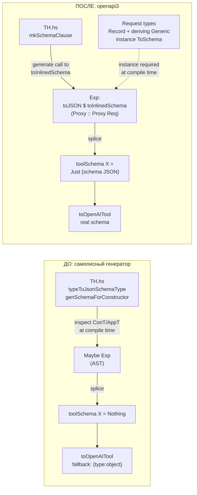
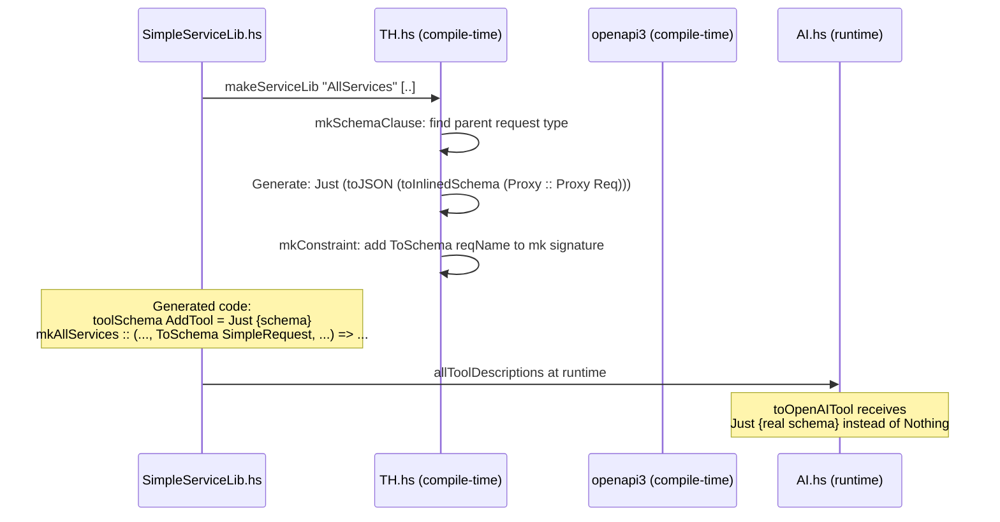
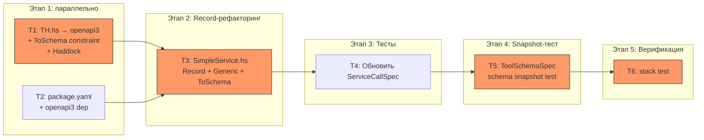

# План: Замена самописного генератора JSON Schema на openapi3

**Дата:** 2027-04-27
**Статус:** В разработке

---

## 1. 🎯 ЦЕЛЬ (Goal)

Заменить самописный генератор JSON-схем в `TH.hs` на генератор из библиотеки `openapi3`
(`Data.OpenApi.Schema.toInlinedSchema`), чтобы каждый инструмент (tool) получал
содержательную JSON Schema своих параметров вместо `Nothing`, корректно
отображаемую в OpenAI Tool Calling API. Все request-типы, передаваемые в
`makeServiceLib` с tool specs, обязаны быть record-типами с `Generic` и
`ToSchema` инстансами.

**Критерий выполнения цели:**

- После вызова `makeServiceLib` сгенерированная функция `toolSchema` для каждого
  инструмента возвращает `Just value`, где `value` — валидная JSON Schema
  (с `"type"`, `"properties"`, `"required"`), описывающая аргументы
  соответствующего request-типа
- `toOpenAITool` в `AI.hs` получает содержательную схему вместо фоллбэка
  `{"type": "object"}`
- Функция `mk{LibName}` имеет `ToSchema` constraint для каждого request-типа
  с tool specs — ранняя ошибка компиляции при отсутствии инстанса
- Все существующие тесты (`stack test`) проходят
- Snapshot-тест `ToolSchemaSpec` верифицирует что генерируемые схемы совпадают
  с hand-written ожидаемыми значениями, описывающими формат, который парсят
  `FromJSON` инстансы
- Haddock-документация `makeServiceLib` содержит требование: request-типы с
  tool specs обязаны быть record-типами с `Generic` и `ToSchema`

---

## 2. ❓ ДОПУЩЕНИЯ И ОТКРЫТЫЕ ВОПРОСЫ (Assumptions)

### Допущения

- 🟢 `openapi3` уже добавлен в `package.yaml` (строка 53) — не нужно менять
  верхнеуровневые зависимости
- 🟢 Функция `toInlinedSchema :: ToSchema a => Proxy a -> Schema` из
  `Data.OpenApi.Schema` доступна и работает с GHC Generic deriving
- 🟢 `Schema` из `openapi3` имеет инстанс `ToJSON`, и `toJSON schema` производит
  JSON, совместимый с OpenAI Tool Calling format (JSON Schema-like)
- 🟢 `GHC2021` (language в package.yaml) включает `DeriveGeneric` — не нужны
  дополнительные LANGUAGE pragmas
- 🟡 `toJSON (toInlinedSchema proxy)` для record-типов даёт JSON вида
  `{"type":"object","properties":{...},"required":[...]}` — совместимо с OpenAI

### Открытые вопросы

_Все вопросы разрешены пользователем._

---

## 3. 🎨 ДИЗАЙН ИЗМЕНЕНИЙ (Design)

### Контекстная диаграмма: до → после



### Схема: поток генерации схемы



### Ключевые архитектурные решения

1. **`toInlinedSchema` вместо `toSchema`** — `toSchema` может генерировать `$ref`
   ссылки для вложенных именованных типов. OpenAI API не умеет разрешать `$ref`.
   `toInlinedSchema` разворачивает все ссылки inline.

2. **Одна схема на request-тип** — все инструменты от одного request-типа
  получают одну схему (с `oneOf` для сумм). Это корректно: все они парсятся
  через один `FromJSON` инстанс, и формат аргументов определяется именно им.

3. **`ToSchema` constraint в `genMkSig`** — добавляется к `mk{LibName}`
  наравне с `FromJSON`/`ToJSON` для раннего обнаружения отсутствующего инстанса.

4. **Record-типы обязательны** — для получения содержательных имён полей в схеме.
  Позиционные конструкторы дают автосгенерированные имена — неприемлемо.
  Требование зафиксировано в Haddock `makeServiceLib`.

### Затрагиваемые модули

| Файл | Изменение |
|------|-----------|
| `src/LazyCircus/App/Service/TH.hs` | Импорты `openapi3`/`Proxy`; переписать `mkSchemaClause`; добавить `ToSchema` constraint; удалить мёртвый код; обновить Haddock |
| `common/SimpleService.hs` | Record-типы; `Generic`/`ToSchema`; обновить `FromJSON`/handlers |
| `package.yaml` | Добавить `openapi3` в зависимости `common-circus` |
| `test/ServiceCallSpec.hs` | Обновить вызовы конструкторов на record-синтаксис |
| `test/ToolSchemaSpec.hs` | **Новый файл** — snapshot-тест генерируемых JSON Schema |

---

## 4. ⚖️ АЛЬТЕРНАТИВЫ (Alternatives)

| Подход | Плюсы | Минусы | Вердикт |
|--------|-------|---------|---------|
| **A: openapi3 `toInlinedSchema` + Record-типы** | Библиотечное решение; чистые схемы с именованными полями; уже в зависимостях | Требует `Generic`/`ToSchema` на request-типах; Record-типы обязательны | ✅ Выбран |
| **B: openapi3 + ручные `ToSchema` инстансы** | Полный контроль над схемой | Дублирование имён полей в `FromJSON` и `ToSchema` | ❌ Бойлерплейт |
| **C: Починить самописный генератор** | Нет новых зависимостей | Не покрывает позиционные конструкторы; не масштабируется | ❌ Фундаментальное ограничение |
| **D: Один инструмент = один request-тип** | Идеальная схема на инструмент | Ломает модель `makeServiceLib` | ❌ Слишком инвазивно |

---

## 5. 📋 ЗАДАЧИ (Tasks)

### Задача T1: Обновить TH.hs — заменить генерацию JSON Schema на openapi3

- **Описание**: Переписать `mkSchemaClause` чтобы вместо ручной инспекции
  конструкторов генерировать код, вызывающий
  `toJSON (toInlinedSchema (Proxy :: Proxy ReqType))`. Добавить `ToSchema`
  constraint в `genMkSig`. Удалить мёртвый код. Обновить Haddock `makeServiceLib`
  с требованием Record-типов и `ToSchema` инстансов.
- **Файлы для просмотра**:
  - `src/LazyCircus/App/Service/TH.hs` — ключевые функции:
    - `mkSchemaClause` (строки 451–464) — переписать
    - `genSchemaForConstructor` (строки 471–521) — удалить
    - `typeToJsonSchemaType` (строки 58–73) — удалить
    - `schemaTypeE` (строки 76–77), `kvE` (строки 80–81), `textE` (строки 84–85) — удалить
    - `genToolSchema` (строки 437–445) — обновить Haddock
    - `mkConstraint` внутри `genMkSig` (строки 280–288) — добавить `ToSchema`
    - `makeServiceLib` Haddock (строки 906–940) — обновить документацию
- **Правки**:
  - Добавить импорты:
    ```haskell
    import Data.OpenApi.Schema (ToSchema, toInlinedSchema)
    import Data.Proxy (Proxy (..))
    ```
  - Переписать `mkSchemaClause`: вместо `genSchemaForConstructor` генерировать:
    ```haskell
    -- TH expression for: Just (toJSON (toInlinedSchema (Proxy :: Proxy parentReq)))
    let proxyExpr = SigE (ConE 'Proxy) (AppT (ConT ''Proxy) (ConT parentReq))
        schemaExpr = AppE (VarE 'toInlinedSchema) proxyExpr
        valueExpr  = AppE (VarE 'toJSON) schemaExpr
        body       = AppE (ConE 'Just) valueExpr
    ```
  - В `mkConstraint` (строки 280–288) добавить:
    ```haskell
    AppT (ConT ''ToSchema) (ConT reqName)
    ```
    в список constraints когда `specs` не пустой.
  - Удалить: `genSchemaForConstructor`, `typeToJsonSchemaType`, `schemaTypeE`,
    `kvE`, `textE`
  - Обновить Haddock `makeServiceLib`: добавить требование
    "Request types with tool specs must be record types with derived `Generic`
    and `ToSchema` instances."
- **Ловушки и подводные камни**:
  - ⚠️ `'Proxy` — конструктор данных из `Data.Proxy`, `''Proxy` — тайп-конструктор.
    В TH нужно оба: `SigE (ConE 'Proxy) (AppT (ConT ''Proxy) (ConT reqName))`
  - ⚠️ `'toJSON` уже используется в TH.hs для `encodeToolResponse` — это Aeson
    `toJSON`, не openapi3. Убедиться что `toJSON` на `Schema` — это именно Aeson's
    `ToJSON Schema` instance (он и есть, т.к. Schema — из openapi3)
  - ⚠️ `toInlinedSchema` может зависнуть на рекурсивных типах. Задокументировать
    ограничение: request-типы не должны быть рекурсивными
  - ⚠️ После удаления `textE` убедиться что она не используется в других местах
    файла (она используется только в `schemaTypeE` и `kvE`, которые тоже удаляются)
- **Критерий выполнения**:
  - `hpack && stack build` компилируется
  - В сгенерированном коде `toolSchema` содержит вызовы
    `toJSON (toInlinedSchema (Proxy :: Proxy ...))` вместо `Nothing`
  - Сигнатура `mkAllServices` содержит `ToSchema SimpleRequest` constraint
- **Зависимости**: Нет
- **Группа параллелизма**: `wt-1`
- **Сложность / Риск / Ценность**: Medium / 🟡 / 🔴

---

### Задача T2: Добавить openapi3 в зависимости common-circus

- **Описание**: `common/SimpleService.hs` (входит в `common-circus`) будет
  определять `ToSchema` инстансы, требующие `Data.OpenApi.Schema`. Нужно
  добавить `openapi3` в зависимости `common-circus` internal library.
- **Файлы для просмотра**:
  - `package.yaml` — секция `internal-libraries: common-circus` (строки 110–131)
- **Правки**:
  - В файле `package.yaml`, в секции `common-circus` dependencies (после строки 130):
    добавить `- openapi3`
- **Ловушки и подводные камни**:
  - ⚠️ `common-circus` зависит от `lazy-circus`, а `lazy-circus` тоже зависит от
    `openapi3`. Это нормально — Cabal/Stack правильно резолвит
- **Критерий выполнения**:
  - `hpack` обновляет `.cabal` файл; `common-circus` секция содержит `openapi3`
- **Зависимости**: Нет
- **Группа параллелизма**: `wt-2`
- **Сложность / Риск / Ценность**: Low / 🟢 / 🔴

---

### Задача T3: Рефакторинг request-типов в Record + Generic + ToSchema

- **Описание**: Переписать `SimpleRequest` и `AddExpressionRequest` из
  позиционных конструкторов в record-типы. Добавить `deriving (Show, Eq, Generic)`.
  Добавить `instance ToSchema`. Обновить `FromJSON`/`ToJSON` инстансы и handlers
  для работы с record-полями.
- **Файлы для просмотра**:
  - `common/SimpleService.hs` — весь файл (71 строка):
    - request-типы (строки 17–29)
    - `FromJSON`/`ToJSON` (строки 33–49)
    - handlers (строки 53–61)
    - `HasFailbackValue` (строки 66–71)
- **Правки**:
  - Добавить импорт:
    ```haskell
    import Data.OpenApi.Schema (ToSchema)
    ```
  - Переписать типы:
    ```haskell
    data SimpleRequest
        = Add { addX :: Int, addY :: Int }
        | Subtract { subX :: Int, subY :: Int }
        deriving (Show, Eq, Generic)

    data SimpleResponse = SimpleResult { simpleResultValue :: Int }
        deriving (Show, Eq, Generic)

    data AddExpressionRequest = AddExpressionRequest
        { addExpressionRequestExpression :: Text }
        deriving (Show, Eq, Generic)

    data AddExpressionResponse = AddExpressionResult
        { addExpressionResultValue :: Text }
        deriving (Show, Eq, Generic)
    ```
  - Добавить инстансы:
    ```haskell
    instance ToSchema SimpleRequest
    instance ToSchema SimpleResponse
    instance ToSchema AddExpressionRequest
    instance ToSchema AddExpressionResponse
    ```
  - Обновить `FromJSON SimpleRequest` — имена полей в JSON (`"x"`, `"y"`)
    остаются прежними (это JSON protocol, не имена полей Haskell):
    ```haskell
    instance FromJSON SimpleRequest where
        parseJSON = withObject "SimpleRequest" $ \o -> do
            tag <- o .: "tag"
            case tag of
                "add"      -> Add <$> o .: "x" <*> o .: "y"
                "subtract" -> Subtract <$> o .: "x" <*> o .: "y"
                _          -> fail $ "Unknown SimpleRequest tag: " <> unpack tag
    ```
  - Обновить `ToJSON SimpleResponse`:
    ```haskell
    instance ToJSON SimpleResponse where
        toJSON (SimpleResult n) = object ["result" .= n]
    ```
    (без изменений — pattern matching по конструктору работает и с record)
  - Обновить `handleSimpleRequest`:
    ```haskell
    handleSimpleRequest req =
        case req of
            Add{addX, addY}         -> pure $ SimpleResult (addX + addY)
            Subtract{subX, subY}    -> pure $ SimpleResult (subX - subY)
    ```
  - Обновить `handleAddExpressionRequest`:
    ```haskell
    handleAddExpressionRequest AddExpressionRequest{addExpressionRequestExpression} =
        pure $ AddExpressionResult (addExpressionRequestExpression <> "!")
    ```
- **Ловушки и подводные камни**:
  - ⚠️ Record-поля в Haskell с одинаковыми именами в разных конструкторах одного
    типа вызывают конфликт. Использовать уникальные префиксы: `addX`/`subX`
  - ⚠️ `AddExpressionRequest` — конструктор совпадает с именем типа. Record-поле
    называем `addExpressionRequestExpression` (префикс-конвенция), но JSON поле
    остаётся `"expression"` (управляется `FromJSON`)
  - ⚠️ `ToSchema` Generic-деривация использует имена Haskell-полей как property
    names в JSON Schema. Поля `addX`, `subX` дадут `"addX"`, `"subX"` в схеме,
    а не `"x"`, `"y"`. Для совпадения с `FromJSON` нужен кастомный `ToSchema`:
    либо менять имена полей Haskell на `x`/`y` (конфликт!), либо использовать
    `genericDeclareNamedSchema` с `fieldLabelModifier`, либо написать ручной
    `ToSchema` инстанс.
    **Решение:** использовать `fieldLabelModifier`:
    ```haskell
    instance ToSchema SimpleRequest where
        declareNamedSchema = genericDeclareNamedSchema defaultSchemaOptions
            { fieldLabelModifier = dropPrefix }
    ```
    где `dropPrefix` убирает `add`/`sub` → получает `x`/`y`.
    Либо альтернатива: назвать поля `srX`/`srY` (общий префикс) и strip'ить его.
  - ⚠️ Для sum-типа `SimpleRequest` с record-конструкторами Generic `ToSchema`
    использует `sumEncoding`. По умолчанию `defaultTaggedObject`, что даёт
    `{"type": "object", "properties": {"tag": ...}, "oneOf": [...]}`. Это может
    не совпадать с форматом, который ожидает `FromJSON` (`tag` + поля на том же
    уровне). Нужно проверить и при необходимости настроить `sumEncoding`
- **Критерий выполнения**:
  - `hpack && stack build` компилируется
  - `instance ToSchema SimpleRequest` и `instance ToSchema AddExpressionRequest`
    определены
  - Record pattern matching корректно работает в handlers
- **Зависимости**: T1, T2
- **Группа параллелизма**: `wt-1` (после T1)
- **Сложность / Риск / Ценность**: Medium / 🟡 / 🔴

---

### Задача T4: Обновить тесты для record-синтаксиса

- **Описание**: Обновить вызовы конструкторов в тестах с позиционного на
  record-синтаксис (или named field patterns).
- **Файлы для просмотра**:
  - `test/ServiceCallSpec.hs` — строки 74, 79, 82, 89, 98, 110
- **Правки**:
  - Заменить `Add 3 4` → `Add {addX = 3, addY = 4}` (или оставить позиционный —
    record-конструкторы поддерживают и позиционный вызов!)
  - Заменить `Subtract 10 3` → `Subtract {subX = 10, subY = 3}`
  - Заменить `AddExpressionRequest "hello"` →
    `AddExpressionRequest {addExpressionRequestExpression = "hello"}`
  - Заменить `SimpleResult 7` → `SimpleResult {simpleResultValue = 7}`
  - Обновить pattern matching: `Right (SimpleResult 10)` →
    `Right (SimpleResult {simpleResultValue = 10})`
  - **Альтернатива:** record-конструкторы в Haskell поддерживают позиционный
    вызов. Если компилятор не выдаёт предупреждений, можно оставить как есть.
    Проверить с `-Wpartial-fields` и другими флагами.
- **Ловушки и подводные камни**:
  - ⚠️ Record-конструкторы поддерживают позиционный вызов, но с предупреждением
    `-Wincomplete-record-updates`. Проверить что текущие ghc-options не вызывают
    проблем
- **Критерий выполнения**:
  - `stack test` проходит без ошибок
  - Все вызовы конструкторов компилируются
- **Зависимости**: T3
- **Группа параллелизма**: `wt-1`
- **Сложность / Риск / Ценность**: Low / 🟢 / 🟡

---

### Задача T5: Snapshot-тест генерируемых JSON Schema

- **Описание**: Создать отдельный тест `test/ToolSchemaSpec.hs`, который вызывает
  `toolSchema` для каждого инструмента и сравнивает результат с hand-written
  ожидаемыми `Value`. Это regression-тест: если схема меняется (например, после
  обновления openapi3 или изменения `ToSchema` конфигурации) — тест упадёт.
- **Файлы для просмотра**:
  - `common/SimpleServiceLib.hs` — чтобы понять какие `AllServicesTool`
    конструкторы доступны: `AddTool`, `SubtractTool`, `AddExpressionRequestTool`
  - `common/SimpleService.hs` — `FromJSON` инстансы чтобы понять формат JSON,
    который схема должна описывать:
    - `SimpleRequest`: `{"tag": "add"|"subtract", "x": Int, "y": Int}`
    - `AddExpressionRequest`: `{"expression": Text}`
  - `test/ServiceCallSpec.hs` — пример структуры теста с `hspec`
  - `AllServices_Generated.hs` — текущий (сломанный) вывод, чтобы понять
    сигнатуру `toolSchema :: AllServicesTool -> Maybe Value`
- **Правки**:
  - Создать `test/ToolSchemaSpec.hs`:
    ```haskell
    module ToolSchemaSpec where

    import Data.Aeson (Value, object, (.=))
    import SimpleServiceLib
        ( AllServicesTool (..)
        , toolSchema
        )
    import Test.Hspec

    spec :: Spec
    spec = describe "toolSchema" $ do
        it "AddTool returns schema matching SimpleRequest Add variant" $ do
            toolSchema AddTool `shouldBe` Just expectedSimpleRequestSchema

        it "SubtractTool returns schema matching SimpleRequest Subtract variant" $ do
            toolSchema SubtractTool `shouldBe` Just expectedSimpleRequestSchema

        it "AddExpressionRequestTool returns schema matching AddExpressionRequest" $ do
            toolSchema AddExpressionRequestTool `shouldBe` Just expectedAddExpressionSchema

    -- | Схема для SimpleRequest: sum-тип с тегом "tag" и полями "x", "y".
    -- Формат диктуется FromJSON SimpleRequest:
    --   {"tag": "add"|"subtract", "x": Int, "y": Int}
    expectedSimpleRequestSchema :: Value
    expectedSimpleRequestSchema =
        object
            [ "title" .= ("SimpleRequest" :: String)
            , "oneOf" .=
                [ object
                    [ "type" .= ("object" :: String)
                    , "properties" .= object
                        [ "tag" .= object ["type" .= ("string" :: String), "enum" .= ["Add" :: String]]
                        , "x"   .= object ["type" .= ("integer" :: String)]
                        , "y"   .= object ["type" .= ("integer" :: String)]
                        ]
                    , "required" .= ["tag" :: String, "x", "y"]
                    ]
                , object
                    [ "type" .= ("object" :: String)
                    , "properties" .= object
                        [ "tag" .= object ["type" .= ("string" :: String), "enum" .= ["Subtract" :: String]]
                        , "x"   .= object ["type" .= ("integer" :: String)]
                        , "y"   .= object ["type" .= ("integer" :: String)]
                        ]
                    , "required" .= ["tag" :: String, "x", "y"]
                    ]
                ]
            ]

    -- | Схема для AddExpressionRequest: object с полем "expression".
    -- Формат диктуется FromJSON AddExpressionRequest:
    --   {"expression": Text}
    expectedAddExpressionSchema :: Value
    expectedAddExpressionSchema =
        object
            [ "title" .= ("AddExpressionRequest" :: String)
            , "type" .= ("object" :: String)
            , "properties" .= object
                [ "expression" .= object ["type" .= ("string" :: String)]
                ]
            , "required" .= ["expression" :: String]
            ]
    ```
  - **Важно:** точный формат `expectedSimpleRequestSchema` и
    `expectedAddExpressionSchema` может отличаться от того, что реально
    генерирует openapi3 (ключи `title`, структура `oneOf`, имена полей).
    Задача исполнителя:
    1. Дампнуть сгенерированный TH-код по инструкции из `TH_DUMP_GUIDE.md`:
       ```bash
       stack clean && stack build --ghc-options="-ddump-splices" > th_dump.txt 2>&1
       ```
    2. Найти в дампе определение `toolSchema` — увидеть фактические выражения
    3. Запустить тест, посмотреть на diff между фактическим и ожидаемым
    4. **Привести ожидаемое значение в соответствие с реальным выводом openapi3**
       — но только если реальный вывод корректно описывает формат, который
       парсит `FromJSON`.
    Если openapi3 генерирует схему, не совпадающую с `FromJSON` (например,
    имена полей `"addX"` вместо `"x"`) — это баг в конфигурации `ToSchema`,
    и его нужно исправить в T3.
- **Ловушки и подводные камни**:
  - ⚠️ openapi3 добавляет `"title"` с именем типа — нужно проверить, убирает
    ли `toInlinedSchema` этот ключ или нет. Если нет — добавить в expected
  - ⚠️ Для sum-типов openapi3 по умолчанию использует `defaultTaggedObject`
    sumEncoding — это может давать структуру с вложенным `"contents"` вместо
    плоских полей. Если так — нужно настроить `sumEncoding` в `ToSchema`
    для `SimpleRequest`
  - ⚠️ openapi3 может не генерировать `"enum": ["Add"]` для тегов, а просто
    `"type": "string"`. Проверить фактический вывод
  - ⚠️ Порядок ключей в JSON `object` может не совпадать. Aeson `object`
    сохраняет порядок, а openapi3 может использовать `InsOrdHashMap`.
    Использовать `shouldBe` (оно сравнивает по структуре, а не по строке)
- **Критерий выполнения**:
  - `stack test --test-arguments -m toolSchema` проходит
  - `toolSchema AddTool` возвращает `Just` с `"properties"` и `"required"`
  - Схема содержит поля `"x"`, `"y"` (не `"addX"`, `"subX"`) — совпадает с
    форматом, который парсит `FromJSON`
  - Схема для `AddExpressionRequestTool` содержит поле `"expression"`
- **Зависимости**: T3, T4
- **Группа параллелизма**: `wt-1`
- **Сложность / Риск / Ценность**: Medium / 🟡 / 🔴

---

### Задача T6: Верификация — полная сборка и тесты

- **Описание**: Полная верификация: собрать проект, запустить все тесты,
  проверить что snapshot-тест схем и все остальные тесты проходят.
  При необходимости — задампить TH-код через `TH_DUMP_GUIDE.md` для финальной
  инспекции.
- **Файлы для просмотра**:
  - `AllServices_Generated.hs` — обновлённый вывод `toolSchema`
  - `test/ToolSchemaSpec.hs` — новый snapshot-тест
  - `test/ServiceCallSpec.hs` — тесты с AllServices
  - `test/AIAgentSpec.hs` — тесты с ToolDescription
- **Правки**:
  - Если какие-либо тесты падают — исправить
  - Проверить что `toOpenAITool` получает реальную схему
- **Ловушки и подводные камни**:
  - ⚠️ `stack test` требует запущенный PostgreSQL
  - ⚠️ `AIAgentSpec` строка 103: `ToolDescription "test_tool" "A test tool" Nothing`
    — это ручное создание, не затронуто. Но если есть проверки на схему — упадёт
  - ⚠️ openapi3 может генерировать ключи вроде `"nullable"` вместо
    `"type": ["string", "null"]` — проверить совместимость с OpenAI API
- **Критерий выполнения**:
  - `hpack && stack build && stack test` — всё компилируется и проходит
  - В сгенерированном коде `toolSchema` возвращает `Just ...` для всех инструментов
  - Snapshot-тест `ToolSchemaSpec` проходит
- **Зависимости**: T3, T4, T5
- **Группа параллелизма**: `wt-1`
- **Сложность / Риск / Ценность**: Low / 🟡 / 🔴

---

## 6. 🗺️ ПЛАН ВЫПОЛНЕНИЯ (Execution Plan)



**Критический путь:** T1 → T3 → T4 → T5 → T6

**Параллельные ветки:**
- `wt-1`: T1 → T3 → T4 → T5 → T6 (основная ветка, TH + типы + тесты)
- `wt-2`: T2 (package.yaml — независимое изменение)

**Рекомендации по приоритетам:**
1. Начать с **T1** (ядро) и **T2** (зависимость) параллельно
2. **T3** — самый рискованный этап (record-рефакторинг + fieldLabelModifier + sumEncoding для ToSchema)
3. **T4** — механические правки тестов
4. **T5** — snapshot-тест: задампить TH-код через `TH_DUMP_GUIDE.md`, записать ожидаемые схемы, при необходимости донастроить `ToSchema` в T3
5. **T6** — финальная верификация
