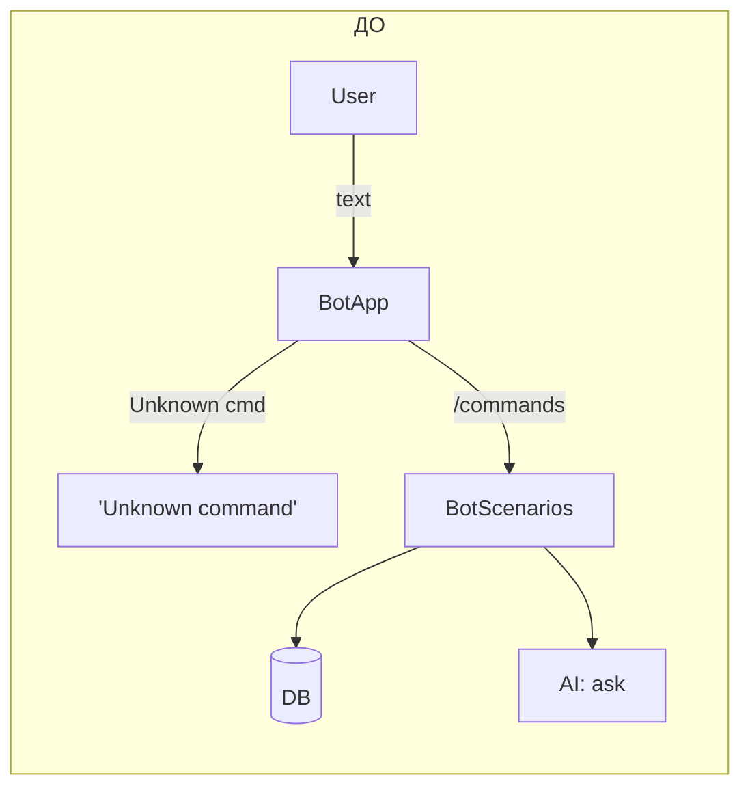
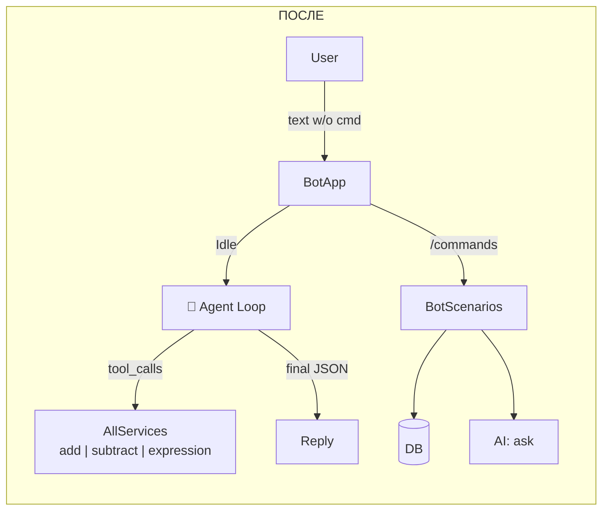
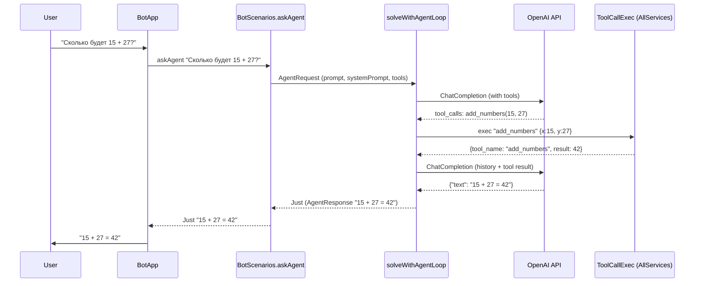
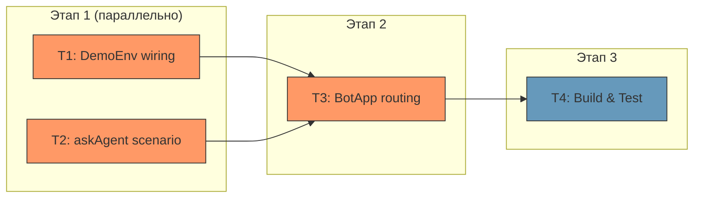

# План: Агентный цикл для бота с тулзами-сервисами

## 🎯 ЦЕЛЬ

**Добавить ботy агентный цикл:** любой текст без команды (в состоянии Idle) отправляется в AI-агент, который автономно решает какие тулзы использовать (`add_numbers`, `subtract_numbers`, `add_expression`) через ReAct-цикл, и возвращает пользователю ответ.

**Критерий выполнения:** Пользователь пишет боту «Сколько будет 15 + 27?» → бот отвечает с результатом, используя тулзу `add_numbers`. Пользователь пишет произвольный текст → агент сам решает нужна ли тулза. Существующие команды (`/start`, `/newact`, `/list`, etc.) работают без изменений.

## ❓ ДОПУЩЕНИЯ

- 🟢 Все сценарии в `BotScenarios` и `DemoScenarios` полиморфны по `serviceLib` — не сломаются при смене типа
- 🟢 `aiScriptWithAll` из `SimpleServiceLib` корректно связывает тулзы с AI-скриптом — уже протестировано в `ServiceCallSpec`
- 🟢 Тесты `BotScenariosSpec` и `AIAgentSpec` не требуют правок — тип `DefaultApp AllServices` протечёт через `withDemoApp` автоматически
- 🟡 Модель `deepseek-v4-flash` поддерживает function calling и JSON output — может потребоваться смена модели если будут проблемы

## 🎨 ДИЗАЙН ИЗМЕНЕНИЙ

### Контекстная диаграмма (ДО)



### Контекстная диаграмма (ПОСЛЕ)



### Поток данных агентного запроса



### Ключевые архитектурные решения

1. **Смена `NoServiceLib` → `AllServices` глобально** — `DemoEnv.withDemoApp` создаёт сервисы, стартует воркеров, устанавливает `toolDescriptions` и `toolCallExec` на `DefaultApp`. Все существующие сценарии и тесты полиморфны по `serviceLib`, поэтому не ломаются.

2. **`aiScriptWithAll`** — TH-сгенерированный смарт-конструктор из `SimpleServiceLib` — привязывает `allToolDescriptions` к AI-скрипту. В связке с `solveWithAgent` из AI scene language даёт нужный ReAct-цикл.

3. **Максимальное число итераций = 10** — достаточно для цепочек типа «(a+b)-c», и при этом защищает от бесконечных циклов.

### Затрагиваемые модули/слои

| Слой | Файл | Изменение |
|------|------|-----------|
| Runtime | `common/DemoEnv.hs` | Создание `AllServices`, wiring в `DefaultApp` |
| Scenario | `common/BotScenarios.hs` | Новая функция `askAgent` |
| Bot UI | `common/BotApp.hs` | Routing Idle→Agent, типы `NoServiceLib`→`AllServices` |

## ⚖️ АЛЬТЕРНАТИВЫ

| Подход | Плюсы | Минусы | Вердикт |
|--------|-------|---------|---------|
| **A: Смена `NoServiceLib` → `AllServices` глобально в `DemoEnv`** | Минимум кода, все сценарии полиморфны, тесты не ломаются | `withDemoApp` всегда создаёт сервисы (лёгкие MVar-воркеры) | ✅ Выбран |
| **B: Отдельный `withBotApp` с `AllServices`** | Изолированность, `withDemoApp` не трогается | Дублирование кода настройки, два пути конфигурации | ❌ Избыточно |
| **C: Параметризация `withDemoApp` по serviceLib** | Максимальная гибкость | Усложняет API, все call sites меняются | ❌ Overengineering |

**Обоснование:** Вариант A простейший — `mkAllServices` создаёт лёгкие `MVar`-воркеры, которые просто блокируются если нет запросов. Все существующие сценарии полиморфны по `serviceLib`, тесты не требуют правок.

## 📋 ЗАДАЧИ

### Задача T1: Подключить `AllServices` в DemoEnv

- **Описание:** Изменить `common/DemoEnv.hs` так, чтобы `withDemoApp` создавал `AllServices` через `mkAllServices`, запускал воркеров сервисов, и устанавливал `appToolDescriptions` и `toolCallExec` на `DefaultApp`. Это ключевой wiring — без него агентный цикл не сможет вызывать тулзы.
- **Файлы для просмотра:**
  - `common/DemoEnv.hs` — текущая реализация `withDemoApp`, `demoConfigToAppConfig`, `runDemoScenario`
  - `test/ServiceCallSpec.hs` — пример правильного wiring `AllServices` (строки 39-66)
  - `common/SimpleServiceLib.hs` — что экспортирует TH-генерация (`AllServices`, `AllServicesConfig(..)`, `mkAllServices`, `allToolDescriptions`, `mkToolCallExec`)
- **Правки:**
  - В `common/DemoEnv.hs`:
    - Добавить импорты: `SimpleService (handleSimpleRequest, handleAddExpressionRequest)`, `SimpleServiceLib (AllServices, AllServicesConfig(..), mkAllServices, allToolDescriptions, mkToolCallExec)`, `LazyCircus.App.Service (runAllWorkers)`
    - Изменить сигнатуру `demoConfigToAppConfig :: DemoConfig -> LAD.DefaultAppConfig NoServiceLib` на `demoConfigToAppConfig :: AllServices -> DemoConfig -> LAD.DefaultAppConfig AllServices`, добавить `LAD.cfgServiceLib = services`
    - Изменить `withDemoApp :: DemoConfig -> (DefaultApp NoServiceLib -> IO ()) -> IO ()` на `withDemoApp :: DemoConfig -> (DefaultApp AllServices -> IO ()) -> IO ()`:
      - Перед `newDefaultApp` создать `AllServices` через `mkAllServices`
      - После `newDefaultApp` установить `toolDescriptionsL .~ allToolDescriptions` и `toolCallExecL .~ mkToolCallExec allServices`
      - Запустить воркеров через `runAllWorkers`, добавить их в cleanup `bracket`
    - Изменить `runDemoScenario :: DefaultApp NoServiceLib -> ...` на `runDemoScenario :: DefaultApp AllServices -> ...`
- **Ловушки и подводные камни:**
  - ⚠️ `toolCallExec` по умолчанию в `newDefaultApp` — это заглушка `fail "ToolCallExec not initialized"`. Нужно обязательно перезаписать через линзу `toolCallExecL`
  - ⚠️ Воркеры сервисов нужно запускать и гасить вместе с остальными потоками в `bracket`
  - ⚠️ `demoConfigToAppConfig` вызывается из `withDemoApp` — нужно передавать `AllServices` как аргумент
- **Критерий выполнения:** `withDemoApp testConfig $ \app -> ...` компилируется с типом `DefaultApp AllServices`, `appToolDescriptions app` содержит 3 тулзы, `toolCallExec app` не падает при вызове
- **Зависимости:** Нет
- **Сложность / Риск / Ценность:** Medium / 🟡 / 🔴

### Задача T2: Добавить сценарий `askAgent` в BotScenarios

- **Описание:** Создать в `common/BotScenarios.hs` функцию `askAgent :: Text -> ScenarioProgram Script serviceLib (Maybe Text)`, которая строит `AgentRequest` с системным промптом и отправляет его через `solveWithAgent` обёрнутый в `aiScriptWithAll`. Определить тип ответа `AgentResponse` и системный промпт для агента.
- **Файлы для просмотра:**
  - `common/BotScenarios.hs` — текущие сценарии, импорты, паттерны
  - `src/LazyCircus/Scene/AI/Lang.hs` — `solveWithAgent :: AgentRequest b -> m (Maybe b)`
  - `src/LazyCircus/AI.hs` — `AgentRequest(..)`, тип полей `agentPrompt`, `agentSystemPrompt`, `agentMaxIterations`
  - `common/SimpleServiceLib.hs` — `aiScriptWithAll :: AIScript b -> Script b`
- **Правки:**
  - В `common/BotScenarios.hs`:
    - Добавить экспорт `askAgent`
    - Добавить импорты: `LazyCircus.Scene.AI.Lang (solveWithAgent)`, `SimpleServiceLib (aiScriptWithAll)`, `LazyCircus.AI (AgentRequest(..))`
    - Определить `AgentResponse` с `FromJSON`/`ToJSON`:
      ```haskell
      newtype AgentResponse = AgentResponse { agentResponseText :: Text }
          deriving (Show, Generic, FromJSON, ToJSON)
      ```
    - Определить `agentSystemPrompt :: [POML]` — роль (circus assistant), таска (answer using tools), правила (use tools for arithmetic, chain calls, output JSON format)
    - Определить `askAgent`:
      ```haskell
      askAgent :: Text -> ScenarioProgram Script serviceLib (Maybe Text)
      askAgent userQuery = do
          withLogContext [("query", userQuery)] $ do
              logInfo "Agent: processing query"
              let req = AgentRequest
                      { agentPrompt = [text userQuery]
                      , agentSystemPrompt = agentSystemPrompt
                      , agentMaxIterations = 10
                      }
              mResult <- evalScript $ aiScriptWithAll $ solveWithAgent req
              case mResult of
                  Nothing -> do
                      logWarn "Agent: no response"
                      pure Nothing
                  Just (AgentResponse resp) -> pure (Just resp)
      ```
- **Ловушки и подводные камни:**
  - ⚠️ `solveWithAgent` в test performer'е возвращает `Nothing` по умолчанию — это нормально, тесты AI agent идут через `solveWithAgentLoop` напрямую
  - ⚠️ Системный промпт должен явно требовать JSON output — в агентном цикле `response_format` НЕ устанавливается (в отличие от `askAI`), поэтому модель должна быть проинструктирована возвращать JSON
  - ⚠️ `aiScriptWithAll` привязывает все 3 тулзы — агент видит все и сам выбирает какие использовать
- **Критерий выполнения:** `askAgent` компилируется, экспортируется, тип корректен. Системный промпт описывает доступные тулзы и требует JSON output.
- **Зависимости:** Нет
- **Сложность / Риск / Ценность:** Medium / 🟡 / 🔴

### Задача T3: Завести агентный цикл в BotApp

- **Описание:** Изменить `common/BotApp.hs` — заменить `NoServiceLib` на `AllServices` в типах, и в кейсе `HandleTextMessage` / `Idle` вместо ответа "Unknown command" вызвать `askAgent` и вернуть результат пользователю.
- **Файлы для просмотра:**
  - `common/BotApp.hs` — `makeBot`, `handleAction`, `HandleTextMessage` в `Idle` (строки 161-164)
  - `test/BotScenariosSpec.hs` — как `runWithDefaultMocks` используется для тестирования
- **Правки:**
  - В `common/BotApp.hs`:
    - Изменить импорт: `LazyCircus.App.Service (NoServiceLib)` → `SimpleServiceLib (AllServices)`
    - Добавить импорт: `BotScenarios (askAgent)` (добавить к существующему импорту)
    - `makeBot :: DefaultApp NoServiceLib -> ...` → `makeBot :: DefaultApp AllServices -> ...`
    - `handleAction :: DefaultApp NoServiceLib -> ...` → `handleAction :: DefaultApp AllServices -> ...`
    - В `HandleTextMessage txt -> case modelChatState model of Idle ->`:
      ```haskell
      Idle -> model <# do
          replyText "🤔 Thinking..."
          result <- liftIO $ CE.try @SomeException $
              runRIO app $ runDefaultPerformer $ run @Script @AllServices (askAgent txt)
          case result of
              Left err -> do
                  liftIO $ hPutStrLn stderr $ "Bot error (agent): " ++ show err
                  replyText "❌ An internal error occurred. Please try again later."
              Right Nothing -> replyText "🤷 I couldn't process your request. Please try again."
              Right (Just response) -> replyText response
          return ()
      ```
    - Заменить все `run @Script @NoServiceLib` на `run @Script @AllServices` в остальных кейсах `handleAction`
- **Ловушки и подводные камни:**
  - ⚠️ `run @Script @AllServices` — type application должно быть `AllServices`, а не `NoServiceLib`
  - ⚠️ Агентный вызов может быть медленным (сетевой запрос к AI API) — стоит показать "Thinking..." до вызова
  - ⚠️ Все остальные кейсы `handleAction` уже используют `run @Script @NoServiceLib` — нужно заменить на `@AllServices` везде
- **Критерий выполнения:** `BotApp` компилируется с `AllServices`. Текст без команды в Idle вызывает `askAgent` и возвращает ответ. Команды `/start`, `/newact`, `/list`, etc. работают без изменений.
- **Зависимости:** T1, T2
- **Сложность / Риск / Ценность:** Medium / 🟡 / 🔴

### Задача T4: Проверить компиляцию и тесты

- **Описание:** Запустить `hpack` + `stack build` + `stack test` и убедиться что всё компилируется и тесты проходят. При необходимости исправить мелкие проблемы.
- **Файлы для просмотра:**
  - Все изменённые файлы при ошибках компиляции
  - `test/BotScenariosSpec.hs` — тесты сценариев
  - `test/AIAgentSpec.hs` — тесты AI
  - `test/ServiceCallSpec.hs` — тесты сервисов
- **Правки:**
  - Исправить ошибки компиляции если возникнут (типы, импорты)
- **Ловушки и подводные камни:**
  - ⚠️ Перед build обязательно `hpack` — проект использует автодискавери модулей
  - ⚠️ Тесты требуют PostgreSQL на `127.0.0.1:5432`
- **Критерий выполнения:** `hpack && stack build` завершается без ошибок, `stack test` проходит
- **Зависимости:** T1, T2, T3
- **Сложность / Риск / Ценность:** Low / 🟢 / 🔴

## 🗺️ ПЛАН ВЫПОЛНЕНИЯ



**Критический путь:** T1 → T3 → T4 (или T2 → T3 → T4)

**Рекомендации по порядку:**
1. **T1 + T2 параллельно** — независимые изменения в разных файлах
2. **T3** — зависит от обоих, сшивает всё вместе
3. **T4** — финальная проверка

**Приоритет по риску:** T1 (🔴 wiring — если неправильно, агент не сможет вызывать тулзы) → T2 (🟡 промпт — может потребовать итерации) → T3 (🟡 механика) → T4 (🟢 проверка)
