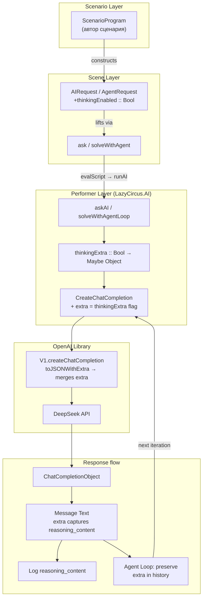
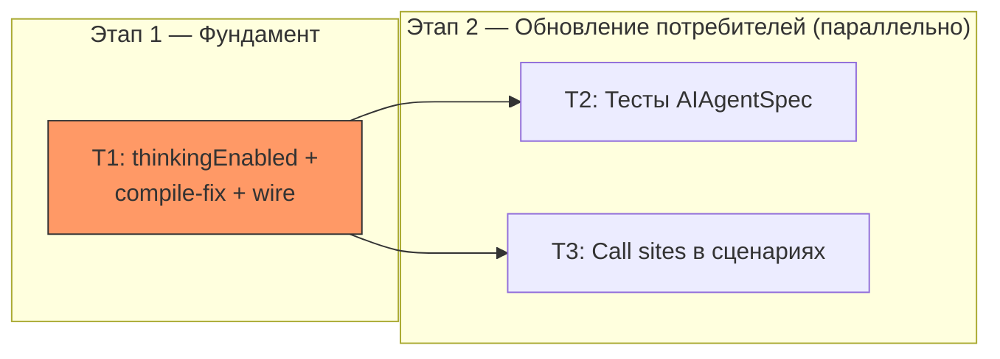

# DeepSeek Thinking Mode Integration

## 1. 🎯 ЦЕЛЬ (Goal)

Система позволяет авторам сценариев включать DeepSeek thinking mode при AI-запросах, чтобы модель могла выполнять chain-of-thought reasoning. При thinking mode `reasoning_content` из ответа корректно сохраняется в истории диалога agent loop (критично для multi-turn с tool calls).

**Критерий выполнения цели:**
- `AIRequest` и `AgentRequest` содержат поле `thinkingEnabled :: Bool`
- При `thinkingEnabled = True` в `CreateChatCompletion.extra` отправляется `{"thinking": {"type": "enabled"}}`
- В agent loop `reasoning_content` из ответа (попадающий в `Message.extra`) сохраняется в assistant-сообщениях при реконструкции истории диалога
- Существующие тесты компилируются и проходят (`stack test`)
- Все Message-конструкторы в кодовой базе включают поле `extra` (compile-fix после обновления openai-library)

---

## 2. ❓ ДОПУЩЕНИЯ И ОТКРЫТЫЕ ВОПРОСЫ (Assumptions)

### Допущения
- 🟢 Библиотека `~/lambda/openai` обновлена: `Message` и `CreateChatCompletion` имеют поле `extra :: Maybe Object` с `toJSONWithExtra`/`parseJSONWithExtra`
- 🟢 `reasoning_content` из ответа DeepSeek попадает в `Message.extra` автоматически через `parseJSONWithExtra` (поле не входит в `knownMessageKeys`)
- 🟢 `_CreateChatCompletion` уже инициализирует `extra = Nothing` — compile error будет только при record construction без `extra`
- 🟢 Модель по умолчанию (`deepseek-chat`) поддерживает thinking mode через `extra_body` — менять модель не нужно
- 🟡 Тесты `AIAgentSpec` тоже требуют compile-fix для `Message` конструкторов в `mockCompletion`

### Открытые вопросы
Нет — требования уточнены.

---

## 3. 🎨 ДИЗАЙН ИЗМЕНЕНИЙ (Design)

### Контекстная диаграмма: как thinking mode проходит через слои



### Ключевые архитектурные решения

**1. Поле `thinkingEnabled :: Bool` в типах запросов**

Добавляется напрямую в `AIRequest` и `AgentRequest`. Это DeepSeek-specific поле, но оно простое и не требует нового типа-обёртки.

**2. `thinkingExtra` — чистая функция `Bool → Maybe Object`**

Конструирует `{"thinking": {"type": "enabled"}}` при `True`, `Nothing` при `False`. Вынесена в отдельную функцию для переиспользования в `askAI` и `solveWithAgentLoop`.

**3. Preservation of `reasoning_content` в agent loop**

Критический момент: DeepSeek документация требует передавать `reasoning_content` обратно в последующих запросах при tool calls. В текущем коде assistant-сообщение конструируется заново, теряя `extra`. Исправление: `Chat.extra = Chat.messageExtra message`.

**4. Логирование reasoning_content**

При thinking mode `reasoning_content` логируется через `SensitiveLogMsg` для observability. Тип возвращаемого значения `m (Maybe a)` не меняется.

### Затрагиваемые модули/слои

| Слой | Модуль | Изменение |
|------|--------|-----------|
| Scene (типы) | `LazyCircus.AI` | +`thinkingEnabled` в `AIRequest`/`AgentRequest`, +`thinkingExtra`, compile-fix Messages, +preserve extra, +log reasoning |
| Scene (facade) | `LazyCircus.Scene.AI` | re-export (без изменений) |
| Tests | `AIAgentSpec` | compile-fix `mockCompletion`, +`thinkingEnabled` в AgentRequest |
| Scenarios | `BotScenarios`, `DemoScenarios` | +`thinkingEnabled = False` |
| Performer | `LazyCircus.Performer.Default` | без изменений (делегирует в `askAI`/`solveWithAgentLoop`) |

---

## 4. ⚖️ АЛЬТЕРНАТИВЫ (Alternatives)

| Подход | Плюсы | Минусы | Вердикт |
|--------|-------|---------|---------|
| **A: `thinkingEnabled :: Bool` в request-типах** | Простота, минимальные изменения, явный контроль на уровне сценария | DeepSeek-specific, нет поддержки других параметров thinking | ✅ Выбран |
| **B: `extra :: Maybe Object` в request-типах** | Максимальная гибкость, любой vendor-specific параметр | Слишком низкоуровневый, пользователь сам конструирует JSON, нет типобезопасности | ❌ Отклонён — пользователь попросил DeepSeek-specific подход |
| **C: Отдельный тип `ThinkingConfig`** | Расширяемость для `reasoning_effort` и др. | Over-engineering для текущей задачи | ❌ Отклонён — когда понадобится, обобщим |

**Обоснование:** Подход A минимален по изменениям, типобезопасен и прямо отвечает задаче. Если DeepSeek добавит новые thinking-параметры, обобщим до подхода C.

---

## 5. 📋 ЗАДАЧИ (Tasks)

---

#### Задача T1: Добавить `thinkingEnabled` + compile-fix Messages + wire thinking в `src/LazyCircus/AI.hs`

- **Описание**: Основная задача. Добавить поле `thinkingEnabled :: Bool` в `AIRequest` и `AgentRequest`. Создать хелпер `thinkingExtra`. Починить все Message-конструкторы (добавить `extra = Nothing`). Подключить thinking в `askAI` и `solveWithAgentLoop`. В agent loop — сохранить `extra` из ответа при реконструкции assistant-сообщения. Добавить логирование `reasoning_content`.

- **Файлы для просмотра**:
  - `src/LazyCircus/AI.hs` — основной файл, все изменения здесь
  - `~/lambda/openai/src/OpenAI/V1/Chat/Completions.hs` — типы `Message`, `CreateChatCompletion`, `messageExtra`, `setMessageExtra`, `_CreateChatCompletion`, `knownMessageKeys`

- **Правки**:

  **В файле `src/LazyCircus/AI.hs`:**

  1. **Добавить поле в `AIRequest`** (строка ~40):
     ```haskell
     data AIRequest a = AIRequest
         { prompt :: [POML]
         , systemPrompt :: [POML]
         , outputType :: Proxy a
         , thinkingEnabled :: Bool  -- ^ enable DeepSeek thinking mode
         }
     ```

  2. **Добавить поле в `AgentRequest`** (строка ~55):
     ```haskell
     data AgentRequest a = AgentRequest
         { agentPrompt :: [POML]
         , agentSystemPrompt :: [POML]
         , agentMaxIterations :: Natural
         , thinkingEnabled :: Bool  -- ^ enable DeepSeek thinking mode
         }
     ```

  3. **Добавить хелпер `thinkingExtra`** (после `defaultModel`, ~строка 48):
     ```haskell
     -- | Construct the DeepSeek thinking extra object.
     -- POST-CONTRACT: Returns 'Just' with @{"thinking": {"type": "enabled"}}@ when True, 'Nothing' when False.
     thinkingExtra :: Bool -> Maybe Object
     thinkingExtra True  = Just $ KM.fromList [("thinking", object ["type" .= ("enabled" :: Text)])]
     thinkingExtra False = Nothing
     ```

  4. **Обновить паттерн-матч в `askAI`** (строка 70):
     ```haskell
     askAI (AIRequest prompt systemPrompt _outputType thinkingEnabled) = do
     ```

  5. **Добавить `extra` в Message-конструкторы и `CreateChatCompletion` в `askAI`** (строки 73-89):
     ```haskell
     let req =
             Chat._CreateChatCompletion
                 { Chat.model = defaultModel
                 , Chat.response_format = Just Chat.JSON_Object
                 , Chat.messages =
                     [ Chat.System
                         { content = [Chat.Text $ renderPOMLtoPrompt systemPrompt]
                         , name = Nothing
                         , extra = Nothing
                         }
                     , Chat.User
                         { content = [Chat.Text $ renderPOMLtoPrompt prompt]
                         , name = Nothing
                         , extra = Nothing
                         }
                     ]
                 , Chat.extra = thinkingExtra thinkingEnabled
                 }
     ```

  6. **Добавить логирование `reasoning_content` в `askAI`** (после строки 93, после извлечения `message`):
     ```haskell
     -- Log reasoning_content if present (DeepSeek thinking mode)
     case choices !? 0 of
         Just Chat.Choice{message} -> do
             logReasoningContent message
         Nothing -> pure ()
     ```
     Где `logReasoningContent` — локальный хелпер:
     ```haskell
     -- | Log reasoning_content from a response message's extra field.
     logReasoningContent :: (HasGLogFunc env, GMsg env ~ AppLogMsgWithContext, HasLoggingContext env, MonadReader env m, MonadIO m) => Chat.Message content -> m ()
     logReasoningContent msg =
         case KM.lookup "reasoning_content" =<< Chat.messageExtra msg of
             Just (String reasoning) -> do
                 logCtx <- view logContextL
                 glog $ AppLogMsgWithContext
                     { logMsg = SensitiveLogMsg $ "AI reasoning: " <> reasoning
                     , logContext = logCtx
                     , logCallSite = Nothing
                     }
             _ -> pure ()
     ```

  7. **Обновить паттерн-матч в `solveWithAgentLoop`** (строка 157):
     ```haskell
     solveWithAgentLoop AgentRequest{agentPrompt, agentSystemPrompt, agentMaxIterations, thinkingEnabled} = go agentMaxIterations initialMessages
     ```

  8. **Добавить `extra = Nothing` в initialMessages** (строки 159-168):
     ```haskell
     initialMessages = V.fromList
         [ Chat.System
             { content = [Chat.Text $ renderPOMLtoPrompt agentSystemPrompt]
             , name = Nothing
             , extra = Nothing
             }
         , Chat.User
             { content = [Chat.Text $ renderPOMLtoPrompt agentPrompt]
             , name = Nothing
             , extra = Nothing
             }
         ]
     ```

  9. **Добавить `Chat.extra` в запрос agent loop** (строки 178-183):
     ```haskell
     req = Chat._CreateChatCompletion
         { Chat.model = defaultModel
         , Chat.messages = history
         , Chat.tools = tools
         , Chat.tool_choice = guard (not (null toolDescs)) >> Just Tool.ToolChoiceAuto
         , Chat.extra = thinkingExtra thinkingEnabled
         }
     ```

  10. **Сохранить `extra` в assistant-сообщении agent loop** (строки 219-225):
      ```haskell
      let assistantMsg = Chat.Assistant
              { Chat.assistant_content = Just [Chat.Text $ Chat.messageToContent message]
              , Chat.refusal = Nothing
              , Chat.name = Nothing
              , Chat.assistant_audio = Nothing
              , Chat.tool_calls = Just tcs
              , Chat.extra = Chat.messageExtra message  -- preserve reasoning_content for DeepSeek thinking
              }
      ```

  11. **Добавить `extra = Nothing` в Tool-сообщение** (строка 227):
      ```haskell
      Chat.Tool { content = [Chat.Text result], tool_call_id = tid, extra = Nothing }
      ```

  12. **Добавить логирование reasoning в финальном ответе agent loop** (перед `decodeContent`):
      В месте, где обрабатывается non-tool-call ответ (строка ~230), добавить:
      ```haskell
      logReasoningContent message
      ```

- **Ловушки и подводные камни**:
  - ⚠️ `Message` в ответе имеет тип `Message Text` (из `Choice`), а в истории `Message (Vector Content)` — но `extra :: Maybe Object` не зависит от параметра типа, так что `messageExtra` работает корректно для обоих
  - ⚠️ При thinking mode DeepSeek игнорирует `temperature`, `top_p`, `presence_penalty`, `frequency_penalty` — но не выдаёт ошибку. Это не требует изменений в нашем коде, но стоит задокументировать
  - ⚠️ `object` возвращает `Value`, а не `Object` — нужно `KM.fromList [...]` для создания `Object`, либо pattern-match `Object o -> o`. В данном случае `KM.fromList [("thinking", object [...])]` создаёт `Object` (`KeyMap Value`) напрямую

- **Критерий выполнения**: `hpack && stack build` компилируется без ошибок. Функция `thinkingExtra True` возвращает `Just` с корректным JSON `{"thinking":{"type":"enabled"}}`.

- **Зависимости**: нет

- **Сложность / Риск / Ценность**: Medium / 🟡 / 🔴

---

#### Задача T2: Обновить тесты в `test/AIAgentSpec.hs`

- **Описание**: Добавить `extra = Nothing` в `mockCompletion` для `Chat.Assistant`. Добавить `thinkingEnabled = False` во все конструкции `AgentRequest`. Добавить один новый тест: verify thinking extra передаётся в API при `thinkingEnabled = True`.

- **Файлы для просмотра**:
  - `test/AIAgentSpec.hs` — все тесты AI agent loop
  - `src/LazyCircus/AI.hs` — чтобы видеть актуальный тип `AgentRequest`

- **Правки**:

  **В файле `test/AIAgentSpec.hs`:**

  1. **Добавить `extra = Nothing` в `mockCompletion`** (строка 51):
     ```haskell
     message = Chat.Assistant
         { Chat.assistant_content = Just contentText
         , Chat.refusal = Nothing
         , Chat.name = Nothing
         , Chat.assistant_audio = Nothing
         , Chat.tool_calls = toolCalls
         , Chat.extra = Nothing  -- compile-fix for updated openai-library
         }
     ```

  2. **Добавить `thinkingEnabled = False` во все `AgentRequest` конструкции** (строки 75, 87, 99, 118, 131, 159, 182, 195, 207, 229):
     ```haskell
     let req = AgentRequest
             { agentPrompt = ...
             , agentSystemPrompt = ...
             , agentMaxIterations = ...
             , thinkingEnabled = False
             }
     ```

  3. **Новый тест: thinking extra передаётся в API**:
     ```haskell
     it "sends thinking extra in request when thinkingEnabled is True" $ \app -> do
         requestRef <- newIORef (Nothing :: Maybe Chat.CreateChatCompletion)
         let mockMethods = (app ^. aiMethodsL) { V1.createChatCompletion = \req -> do
                 writeIORef requestRef (Just req)
                 pure $ mockCompletion "{\"ok\": true}" Nothing "stop"
             }
         let req :: AgentRequest Value = AgentRequest
                 { agentPrompt = ["test"]
                 , agentSystemPrompt = ["test"]
                 , agentMaxIterations = 5
                 , thinkingEnabled = True
                 }
         result <- runRIO (app & aiMethodsL .~ mockMethods) (solveWithAgentLoop req)
         result `shouldBe` Just (object ["ok" .= True])
         sentReq <- readIORef requestRef
         (Chat.extra <$> sentReq) `shouldSatisfy` isJust
     ```

- **Ловушки и подводные камни**:
  - ⚠️ Нужно импортировать `Data.Maybe (isJust)` если ещё не импортирован
  - ⚠️ Проверять `Chat.extra` через `readIORef` — mock-функция получает `CreateChatCompletion`, у которого есть поле `extra`

- **Критерий выполнения**: `hpack && stack test --test-arguments AIAgentSpec` — все тесты проходят, включая новый.

- **Зависимости**: T1

- **Группа параллелизма**: `wt-1`

- **Сложность / Риск / Ценность**: Low / 🟢 / 🟡

---

#### Задача T3: Обновить call sites в сценариях

- **Описание**: Добавить `thinkingEnabled = False` во все конструкции `AIRequest` и `AgentRequest` в `common/BotScenarios.hs` и `app/example/Example/DemoScenarios.hs`.

- **Файлы для просмотра**:
  - `common/BotScenarios.hs` — строки 121 (AgentRequest), 180 (AIRequest)
  - `app/example/Example/DemoScenarios.hs` — строка 252 (AIRequest)

- **Правки**:

  **В файле `common/BotScenarios.hs`:**

  1. **AgentRequest** (строка 121):
     ```haskell
     let req = AgentRequest
             { agentPrompt = [text userQuery]
             , agentSystemPrompt = circusAgentSystemPrompt
             , agentMaxIterations = defaultAgentMaxIterations
             , thinkingEnabled = False
             }
     ```

  2. **AIRequest** (строка 180):
     ```haskell
     mkReactionRequest name desc =
         AIRequest
             { systemPrompt = reactionSystemPrompt
             , prompt = reactionUserPrompt name desc
             , outputType = Proxy @AudienceReaction
             , thinkingEnabled = False
             }
     ```

  **В файле `app/example/Example/DemoScenarios.hs`:**

  3. **AIRequest** (строка 252):
     ```haskell
     let request = AIRequest
           { prompt = [cp_ "Question" ["Describe a circus act in one sentence"]]
           , systemPrompt = demoSystemPrompt
           , outputType = Proxy @AiDescription
           , thinkingEnabled = False
           }
     ```

- **Ловушки и подводные камни**:
  - ⚠️ В `common/BotScenarios.hs` и `app/example/Example/DemoScenarios.hs` включено `DuplicateRecordFields`, поэтому имя `thinkingEnabled` может использоваться в обоих типах без конфликта

- **Критерий выполнения**: `hpack && stack build` компилируется без ошибок после изменений T1 + T3.

- **Зависимости**: T1

- **Группа параллелизма**: `wt-2`

- **Сложность / Риск / Ценность**: Low / 🟢 / 🟡

---

## 6. 🗺️ ПЛАН ВЫПОЛНЕНИЯ (Execution Plan)



**Критический путь:** T1 → T2 (тесты — финальная валидация)

**Рекомендуемый порядок:**
1. **T1** — сначала ядро: типы + compile-fix + wire thinking. После этого проект скомпилируется
2. **T2 + T3** — параллельно: обновить все места, где конструируются `AIRequest`/`AgentRequest`

**Приоритет по риску:** T1 — единственная задача с 🟡 риском (agent loop `extra` preservation), начать с неё
