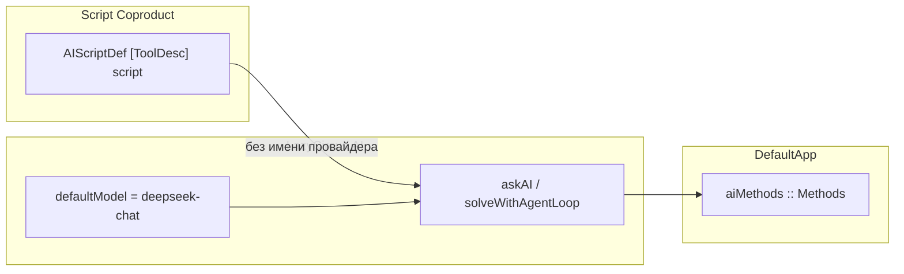
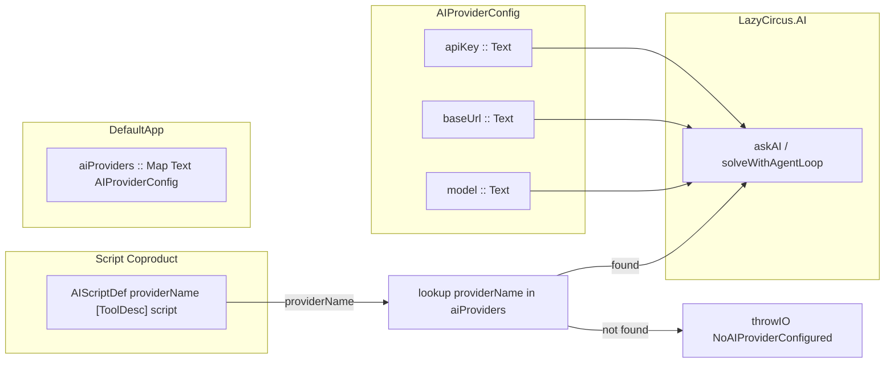
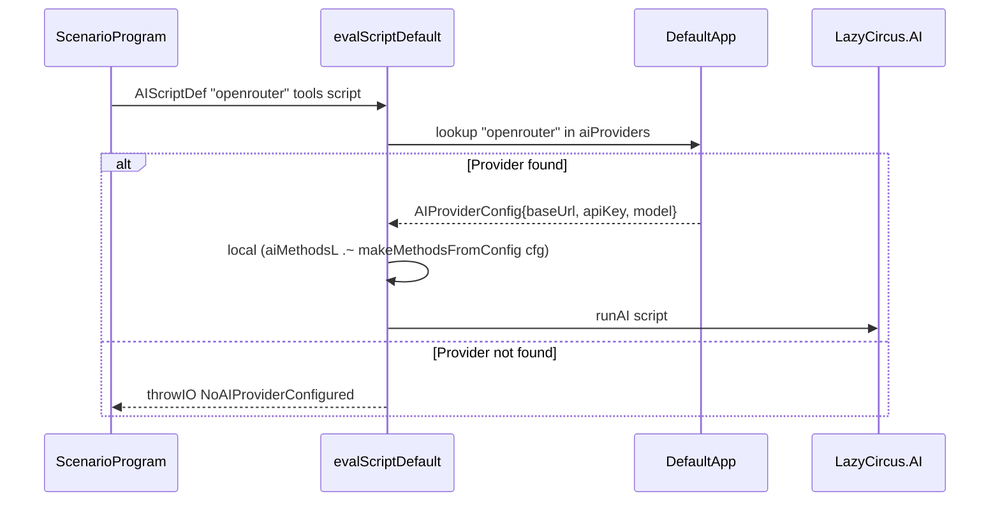
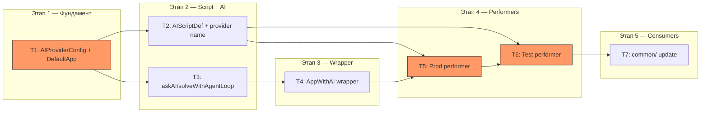

# Plan: Multi AI Providers (DeepSeek + OpenRouter)

## 1. 🎯 ЦЕЛЬ (Goal)

Система поддерживает несколько AI-провайдеров одновременно (DeepSeek, OpenRouter и произвольные OpenAI-совместимые API). При вызове AI-скрипта в `AIScriptDef` указывается имя провайдера — по аналогии с `TelegramScriptDef`, где указывается имя бота. Каждый провайдер конфигурируется независимо (свой API key, base URL, модель).

**Критерий выполнения цели:**
- `Script` содержит `AIScriptDef Text [ToolDescription] (AIScript b)` — первым полем идёт имя провайдера
- `DefaultApp` хранит `Map Text AIProviderConfig` вместо одного `aiMethods :: Methods`
- Продакшен-перформер диспетчеризует AI-скрипт по имени провайдера, создавая `Methods` из конфига провайдера, либо выбрасывая `NoAIProviderConfigured`
- Тестовый перформер по-прежнему возвращает `Nothing` для AI-запросов
- Существующие тесты компилируются и проходят после обновления
- TH-генератор `genSmartConstructors` обновлён: `aiScriptWithAll`/`aiScriptWith` принимают имя провайдера

---

## 2. ❓ ДОПУЩЕНИЯ И ОТКРЫТЫЕ ВОПРОСЫ (Assumptions)

### Допущения
- 🟢 OpenRouter совместим с OpenAI Chat Completions API на уровне, достаточном для `openai` Haskell-библиотеки (подтверждено документацией)
- 🟢 `openai` библиотека корректно работает с произвольным base URL (уже используется с `https://api.deepseek.com`)
- 🟢 Кастомные заголовки OpenRouter (`HTTP-Referer`, `X-OpenRouter-Title`) не нужны сейчас — добавим позже через `managerModifyRequest`
- 🟢 Path handling: `openai` библиотека добавляет `v1` к base URL из Servant API типа. Для OpenRouter base URL указываем `https://openrouter.ai/api` — библиотека добавит `/v1` → итоговый путь `/api/v1/chat/completions`. Для DeepSeek: `https://api.deepseek.com` → `/v1/chat/completions`. Решение: провайдер использует путь как есть, корректность base URL — ответственность конфигурации

### Открытые вопросы
_(нет)_

---

## 3. 🎨 ДИЗАЙН ИЗМЕНЕНИЙ (Design)

### Контекстная диаграмма: До



### Контекстная диаграмма: После



### Схема диспетчеризации (аналогия с Telegram)



### Ключевые типы

```haskell
-- | Конфигурация одного AI-провайдера.
data AIProviderConfig = AIProviderConfig
    { aiProviderBaseUrl :: Text   -- ^ "https://api.deepseek.com" or "https://openrouter.ai/api/v1"
    , aiProviderApiKey  :: Text   -- ^ Bearer token
    , aiProviderModel   :: Text   -- ^ "deepseek-chat", "openai/gpt-4o", etc.
    }

-- | Исключение при отсутствии настроенного провайдера.
newtype NoAIProviderConfigured = NoAIProviderConfigured Text
```

### Затрагиваемые модули/слои

| Слой | Модуль | Изменение |
|------|--------|-----------|
| **Script coproduct** | `LazyCircus.Script` | `AIScriptDef` получает поле `Text` (имя провайдера) |
| **Smart constructors** | `LazyCircus` (re-exports) | `aiScript` принимает имя провайдера |
| **TH codegen** | `LazyCircus.App.Service.TH` | `genSmartConstructors` генерирует с именем провайдера |
| **Config** | `LazyCircus.App.Default` | `DefaultAppConfig`: `cfgAiApiKey`/`cfgAiBaseUrl` → `cfgAiProviders :: Map Text AIProviderConfig` |
| **App runtime** | `LazyCircus.App.Default` | `DefaultApp`: `aiMethods :: Methods` → `aiProviders :: Map Text AIProviderConfig` |
| **HasAIMethods** | `LazyCircus.AI` | Замена на `HasAIProviders` (новый класс) или пересмотр |
| **AI core** | `LazyCircus.AI` | `askAI`/`solveWithAgentLoop` принимают `Methods` и `Model` из аргументов |
| **Performer (prod)** | `LazyCircus.Performer.Default` | `evalScriptDefault` диспетчеризует по имени провайдера |
| **Performer (test)** | `LazyCircus.Testing.Performer` | `runScript` диспетчеризует `AIScriptDef` с именем провайдера |
| **Env wrappers** | `LazyCircus.DB.WithConnection` | Обновление деривации `HasAIMethods` → `HasAIProviders` |
| **Tests** | `test/AIAgentSpec.hs` | Обновление на использование нового API |

---

## 4. ⚖️ АЛЬТЕРНАТИВЫ (Alternatives)

| Подход | Плюсы | Минусы | Вердикт |
|--------|-------|---------|---------|
| **A: Map Text AIProviderConfig + dispatch по имени** (Telegram-паттерн) | Единообразие с Telegram-ботами; явный выбор провайдера; конфигурация через Map; легко добавлять провайдеры | Нужно менять сигнатуру `AIScriptDef`; обновлять TH; обновлять все вызовы | ✅ Выбран |
| **B: Предсозданные Methods на старте (Map Text Methods)** | Быстрый dispatch — нет создания ClientEnv при каждом вызове | Methods — тяжёлый объект (держит Manager); нет лени; сложнее логировать конфигурацию | ❌ Отклонён — преждевременная оптимизация, а `getClientEnv` + `makeMethods` достаточно быстрый |
| **C: Провайдер в AIRequest/AgentRequest (per-request)** | Максимальная гибкость | Усложняет API DSL; нарушает аналогию с Telegram; избыточно для текущих потребностей | ❌ Отклонён |

**Обоснование выбора**: Подход A выбран за единообразие с паттерном Telegram-ботов. `AIScriptDef "deepseek" [] $ ask req` зеркально повторяет `TelegramScriptDef "main-bot" $ sendMessage msg`.

---

## 5. 📋 ЗАДАЧИ (Tasks)

### Задача T1: Ввести AIProviderConfig и обновить DefaultApp
- **Описание**: Создать тип `AIProviderConfig` (baseUrl, apiKey, model). Заменить в `DefaultApp` поле `aiMethods :: Methods` на `aiProviders :: Map Text AIProviderConfig`. Обновить `DefaultAppConfig`: убрать `cfgAiApiKey`/`cfgAiBaseUrl`, добавить `cfgAiProviders`. Обновить `newDefaultApp` — убрать создание `Methods`, хранить только `Map Text AIProviderConfig`. Заменить `HasAIMethods` на `HasAIProviders` с линзой на `Map Text AIProviderConfig`. Добавить `NoAIProviderConfigured` исключение.
- **Файлы для просмотра**:
  - `src/LazyCircus/AI.hs` — класс `HasAIMethods`, текущая структура
  - `src/LazyCircus/App/Default.hs` — `DefaultApp`, `DefaultAppConfig`, `newDefaultApp`, все instance declarations
- **Правки**:
  - В `src/LazyCircus/AI.hs`: заменить класс `HasAIMethods env where aiMethodsL :: Lens' env V1.Methods` на `HasAIProviders env where aiProvidersL :: Lens' env (Map Text AIProviderConfig)`. Добавить `AIProviderConfig` data type. Добавить `NoAIProviderConfigured`. Добавить helper `makeMethodsFromConfig :: AIProviderConfig -> IO V1.Methods`
  - В `src/LazyCircus/App/Default.hs`: заменить `aiMethods :: Methods` на `aiProviders :: Map Text AIProviderConfig` в `DefaultApp`. Заменить `cfgAiApiKey`/`cfgAiBaseUrl` на `cfgAiProviders :: Map Text AIProviderConfig` в `DefaultAppConfig`. Обновить `newDefaultApp` — убрать создание `aiMethodsVal`. Обновить instance `HasAIMethods` → `HasAIProviders`
- **Ловушки и подводные камни**:
  - ⚠️ `V1.Methods` держит `Manager` — не нужно создавать его при каждом AI-запросе. **Решение**: создавать `Methods` один раз при `newDefaultApp` и хранить `Map Text (V1.Methods, Text)` где `Text` — модель
  - ⚠️ Base URL для OpenRouter должен быть `https://openrouter.ai/api` (без `/v1` на конце) — библиотека добавит `/v1` сама. Это ответственность конфигурации, а не кода
- **Критерий выполнения**: `DefaultApp` компилируется с новым типом поля; `HasAIProviders` имеет lens на Map; старый `HasAIMethods` удалён
- **Зависимости**: нет
- **Сложность / Риск / Ценность**: Medium / 🟡 / 🔴
- **Группа параллелизма**: `wt-1`

### Задача T2: Обновить AIScriptDef в Script coproduct
- **Описание**: Добавить поле имени провайдера в `AIScriptDef`. Обновить smart constructors (`aiScript`, `aiScriptWithAll`, `aiScriptWith`). Обновить модуль `LazyCircus` (facade).
- **Файлы для просмотра**:
  - `src/LazyCircus/Script.hs` — `AIScriptDef` конструктор
  - `src/LazyCircus.hs` — `aiScript` smart constructor
  - `src/LazyCircus/App/Service/TH.hs` — `genSmartConstructors` (строки ~700-760)
- **Правки**:
  - В `src/LazyCircus/Script.hs`: изменить `AIScriptDef :: [ToolDescription] -> AIScript b -> Script b` на `AIScriptDef :: Text -> [ToolDescription] -> AIScript b -> Script b` (первым полем — имя провайдера)
  - В `src/LazyCircus.hs`: изменить `aiScript = AIScriptDef []` на `aiScript providerName = AIScriptDef providerName []`
  - В `src/LazyCircus/App/Service/TH.hs`: обновить `genAiScriptWithAll` — частичное применение `AIScriptDef` теперь требует имя провайдера. Добавить `providerName` как параметр функции или использовать дефолт. **Решение**: `aiScriptWithAll` должен принимать имя провайдера: `aiScriptWithAll :: Text -> AIScript b -> Script b`
- **Ловушки и подводные камни**:
  - ⚠️ Все существующие вызовы `AIScriptDef` сломаются — нужно обновить все consumer'ы. TH-генератор генерирует `aiScriptWithAll` и `aiScriptWith` — нужно обновить их сигнатуры
  - ⚠️ В TH-коде `genAiScriptWithAll` (строка 724) используется `AppE (ConE 'AIScriptDef) (VarE (mkName "allToolDescriptions"))` — теперь нужно добавить первый аргумент (имя провайдера). Пусть `aiScriptWithAll` принимает имя провайдера первым аргументом
- **Критерий выполнения**: `AIScriptDef "deepseek" [] (ask req)` компилируется; TH-генератор генерирует корректные `aiScriptWithAll`/`aiScriptWith` с параметром имени провайдера
- **Зависимости**: T1 (нужно знать HasAIProviders)
- **Сложность / Риск / Ценность**: Medium / 🟡 / 🔴
- **Группа параллелизма**: `wt-1`

### Задача T3: Обновить LazyCircus.AI — askAI/solveWithAgentLoop
- **Описание**: Изменить `askAI` и `solveWithAgentLoop` так, чтобы они принимали `V1.Methods` и модель как аргументы (или из environment через обновлённый класс). Убрать `defaultModel`. Добавить helper для создания `Methods` из конфига провайдера.
- **Файлы для просмотра**:
  - `src/LazyCircus/AI.hs` — `askAI`, `solveWithAgentLoop`, `defaultModel`, `HasAIMethods`
- **Правки**:
  - Удалить `defaultModel`
  - Изменить `HasAIMethods` → `HasAIProviders` (если не сделано в T1)
  - `askAI` и `solveWithAgentLoop` должны читать `Methods` и model из environment. **Подход**: вместо lens на Map, использовать промежуточный wrapper. Либо: `askAI` и `solveWithAgentLoop` читают `Methods` и model из lens, а lens уже «знает» какой провайдер активен (выбран через `local`). Это аналогично тому как Telegram инжектит `BotEnv` через `changeEnv (AppWithBotEnv botEnv)`.
  - **Выбранный подход**: создать wrapper `AppWithAI providerApp` (аналог `AppWithBotEnv`), который хранит выбранный `Methods` и `model`. `askAI`/`solveWithAgentLoop` читают через `HasAIMethods` lens на этот wrapper. Продакшен-перформер делает `changeEnv` перед вызовом `runAI`.
- **Ловушки и подводные камни**:
  - ⚠️ Нужно сохранить backward compatibility в логике — сами функции `askAI`/`solveWithAgentLoop` не должны меняться по логике, только по источнику `Methods` и `model`
  - ⚠️ `model` раньше была захардкожена, теперь — из конфига провайдера. Нужно, чтобы `model` была доступна через lens
- **Критерий выполнения**: `askAI` и `solveWithAgentLoop` компилируются и используют model из аргумента/lens; `defaultModel` удалён
- **Зависимости**: T1
- **Сложность / Риск / Ценность**: Medium / 🟡 / 🔴
- **Группа параллелизма**: `wt-1`

### Задача T4: Создать AppWithAI wrapper (аналог AppWithBotEnv)
- **Описание**: Создать тип `AppWithAI app` в `LazyCircus/AI/Types.hs` (или в `LazyCircus/AI.hs`), который хранит `aiMethods :: V1.Methods` и `aiModel :: Text` вместе с underlying app. Сделать instance `HasAIMethods` для этого wrapper, который отдаёт `aiMethods`. Это позволит `askAI`/`solveWithAgentLoop` работать как раньше, читая `Methods` из lens.
- **Файлы для просмотра**:
  - `src/LazyCircus/Telegram/Types.hs` — `AppWithBotEnv` (шаблон)
  - `src/LazyCircus/DB/WithConnection.hs` — `AppWithConnection` (шаблон)
  - `src/LazyCircus/AI.hs` — где определить wrapper
- **Правки**:
  - Создать `src/LazyCircus/AI/Types.hs` (новый файл):
    ```haskell
    data AppWithAI app = AppWithAI
        { appAIMethods :: V1.Methods
        , appAIModel   :: Text
        , appAIUnderlying :: app
        }
    ```
  - Instances: `HasAIMethods`, `HasAIModel` (новый класс для model), плюс delegation всех остальных классов через `appAIUnderlying`
  - Обновить экспорты `LazyCircus/AI.hs`
- **Ловушки и подводные камни**:
  - ⚠️ Нужно делегировать **все** instance классы из `DefaultApp` (HasLogFunc, HasGLogFunc, HasProcessContext, HasPgConnection, HasBotEnvs, etc.) через underlying app — как в `AppWithConnection`. Это рутинная, но объёмная работа
  - ⚠️ `HasToolDescriptions` и `HasToolCallExec` тоже нужно делегировать — они используются в `solveWithAgentLoop`
- **Критерий выполнения**: `AppWithAI` компилируется со всеми нужными instance; `askAI`/`solveWithAgentLoop` могут работать в `ReaderT (AppWithAI app)`
- **Зависимости**: T1, T3
- **Сложность / Риск / Ценность**: Medium / 🟡 / 🔴
- **Группа параллелизма**: `wt-1`

### Задача T5: Обновить продакшен-перформер (evalScriptDefault)
- **Описание**: Обновить диспетчеризацию `AIScriptDef` в `evalScriptDefault`. При получении `AIScriptDef providerName descs scr` — lookup провайдера в `aiProviders`, создание `AppWithAI` с нужными `Methods` и `model`, вызов `changeEnv` + `runAI`.
- **Файлы для просмотра**:
  - `src/LazyCircus/Performer/Default.hs` — `evalScriptDefault` (строка ~129-144), `AILangPerformer` instance
- **Правки**:
  - В `evalScriptDefault (AIScriptDef providerName descs scr)`: lookup `providerName` в `aiProviders`. Если не найден — `throwIO $ NoAIProviderConfigured providerName`. Если найден — `local (toolDescriptionsL .~ descs)` + `changeEnv (AppWithAI methods model)` + `runAI scr`
  - Обновить `AILangPerformer` instance для `DefaultPerformer (AppWithAI (DefaultApp serviceLib))`
- **Ловушки и подводные камни**:
  - ⚠️ `Methods` создаются из `AIProviderConfig` — нужно вызывать `getClientEnv` + `makeMethods`. Это IO. Нельзя делать IO внутри `evalScriptDefault` (он в `DefaultPerformer`). **Решение**: создавать `Methods` заранее при `newDefaultApp` и хранить `Map Text (V1.Methods, Text)` — Methods + model. Это упрощает T1 — вместо `AIProviderConfig` в runtime храним уже готовый `Map Text (V1.Methods, Text)`
  - ⚠️ `HasAIMethods` instance нужен для `AppWithAI`, не для `DefaultApp`. `DefaultApp` предоставляет `HasAIProviders` (Map)
- **Критерий выполнения**: `evalScriptDefault (AIScriptDef "deepseek" [] scr)` находит провайдер "deepseek" и вызывает runAI; при отсутствии провайдера бросает `NoAIProviderConfigured`
- **Зависимости**: T1, T3, T4
- **Сложность / Риск / Ценность**: Medium / 🟡 / 🔴
- **Группа параллелизма**: `wt-1`

### Задача T6: Обновить тестовый перформер (Testing.Performer)
- **Описание**: Обновить `runScript` в тестовом перформере для новой сигнатуры `AIScriptDef`. Обновить instance `HasAIProviders` для `EnvWithMocks`. Обновить все тестовые вызовы `AIScriptDef`.
- **Файлы для просмотра**:
  - `src/LazyCircus/Testing/Performer.hs` — `runScript` (строка ~269-273), `HasAIMethods` instance (строка ~209-210)
  - `test/AIAgentSpec.hs` — все вызовы `AIScriptDef`
- **Правки**:
  - В `Testing/Performer.hs`: обновить `runScript (AIScriptDef providerName descs scr)` — тестовый перформер по-прежнему просто делает `local (toolDescriptionsL .~ descs) $ runAI script`, игнорируя имя провайдера (т.к. `ask'` возвращает `Nothing`)
  - Заменить `HasAIMethods` instance на `HasAIProviders` для `EnvWithMocks`
  - В `test/AIAgentSpec.hs`: обновить все `AIScriptDef [] (solveWithAgent req)` на `AIScriptDef "test" [] (solveWithAgent req)` (или любой дефолтный name)
- **Ловушки и подводные камни**:
  - ⚠️ `solveWithAgentLoop` в тестах вызывается напрямую через `runRIO` с mock `aiMethodsL` — нужно обновить на `aiProvidersL` или сохранить `HasAIMethods` для `DefaultApp` при тестах. **Решение**: тесты `solveWithAgentLoop` используют прямой lens на `aiMethodsL` для mock'а. Нужно пересмотреть — либо тесты мокают `aiProvidersL`, либо сохраняем `aiMethodsL` lens для тестовых целей
- **Критерий выполнения**: Все тесты компилируются и проходят
- **Зависимости**: T1, T2, T5
- **Сложность / Риск / Ценность**: Medium / 🟡 / 🔴
- **Группа параллелизма**: `wt-1`

### Задача T7: Обновить common-модуль (DemoEnv, BotScenarios, SimpleServiceLib)
- **Описание**: Обновить конфигурацию DemoEnv (использует `cfgAiApiKey`/`cfgAiBaseUrl`), обновить вызовы `AIScriptDef`/`aiScript`/`aiScriptWithAll` в BotScenarios и TH-generated коде SimpleServiceLib.
- **Файлы для просмотра**:
  - `common/BotScenarios.hs` — вызовы `aiScript`, `aiScriptWithAll`
  - `common/DemoEnv.hs` — конфигурация `cfgAiApiKey`, `cfgAiBaseUrl`
  - `common/SimpleServiceLib.hs` — TH-generated `aiScriptWithAll`
- **Правки**:
  - В `DemoEnv.hs`: заменить `cfgAiApiKey`/`cfgAiBaseUrl` на `cfgAiProviders = Map.fromList [("deepseek", AIProviderConfig{...})]`
  - В `BotScenarios.hs`: обновить `aiScript $ ask req` → `aiScript "deepseek" $ ask req`; `aiScriptWithAll $ solveWithAgent req` → `aiScriptWithAll "deepseek" $ solveWithAgent req`
  - В `SimpleServiceLib.hs`: проверить, что TH-генератор обновлён (T2)
- **Ловушки и подводные камни**:
  - ⚠️ `aiScriptWithAll` — TH-generated, после обновления TH (T2) имя провайдера нужно передавать в вызов
- **Критерий выполнения**: `common/` компилируется; пример приложения запускается
- **Зависимости**: T2, T6
- **Сложность / Риск / Ценность**: Low / 🟢 / 🟡
- **Группа параллелизма**: `wt-1`

---

## 6. 🗺️ ПЛАН ВЫПОЛНЕНИЯ (Execution Plan)

### Граф зависимостей



**Критический путь**: T1 → T3 → T4 → T5 → T6 → T7

### Рекомендации по порядку выполнения

1. **T1** — Начать с фундамента (типы, конфигурация, DefaultApp). Здесь важнее всего проверить что `getClientEnv` корректно работает с `/api/v1` path для OpenRouter
2. **T2 + T3** — Можно делать параллельно после T1, но обе в `wt-1` — по порядку
3. **T4** — Wrapper тип, зависит от T3
4. **T5** — Самый важный интеграционный этап — продакшен-перформер
5. **T6** — Тесты — validates everything
6. **T7** — Обновление consumer'ов

### Приоритеты по риску
- 🟡 **T4** — Объёмная рутинная работа по instance делегированию, легко ошибиться
- 🟡 **T5** — Интеграционный этап — продакшен-перформер, связывает всё вместе
- 🟡 **T6** — Тесты должны компилироваться — если что-то упущено, станет видно здесь
