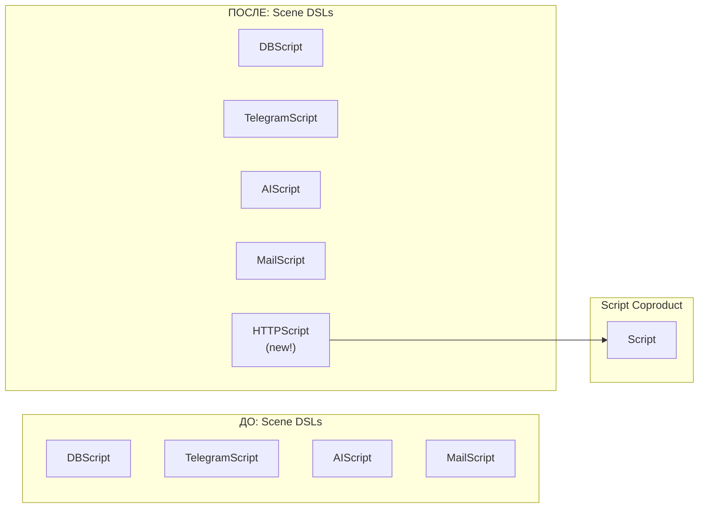
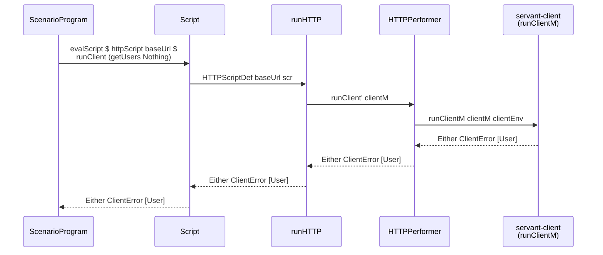
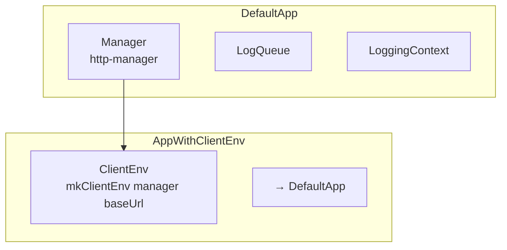
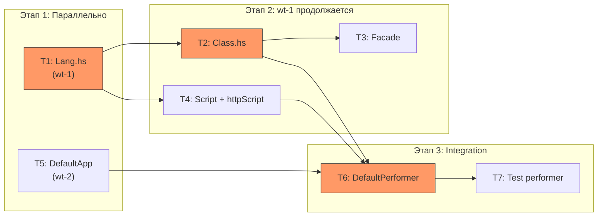

# HTTP Scene Language — прослойка над servant-client

## 🎯 ЦЕЛЬ

Добавить в Lazy Circus новый сценовый язык `HTTPScript`, который является тонкой прослойкой над `servant-client`, позволяя выполнять любые `ClientM a` действия внутри `ScenarioProgram`. API зеркально отражает servant-client: единственная операция `runClient` принимает `ClientM a` и возвращает `Either ClientError a`, а `BaseUrl` для выполнения передаётся через конструктор `Script` (аналогично `tgScript`, принимающему имя бота).

**Критерий выполнения цели:**
- Можно определить servant API, сгенерировать клиентские функции через `client`, и выполнить их внутри `ScenarioProgram` через `evalScript $ httpScript baseUrl $ runClient myAction`
- `runClient` возвращает `Either ClientError a`, зеркально отражая `runClientM` из servant-client
- Внутри `HTTPScript` доступны `slogInfo`/`slogWarn`/`slogError`/`swithLogCtx` как в других сценовых языках
- Production-рантайм использует shared `Manager` из `DefaultApp`, конструируя `ClientEnv` на лету
- Test-рантайм выполняет реальные HTTP-запросы (как DB использует реальную PostgreSQL)
- Проект компилируется (`hpack && stack build`) и существующие тесты проходят (`stack test`)

---

## ❓ ДОПУЩЕНИЯ И ОТКРЫТЫЕ ВОПРОСЫ

**Допущения:**
- 🟢 `servant-client`, `http-client`, `http-client-tls` уже в зависимостях — подтверждаю по `package.yaml`
- 🟢 `BaseUrl` из `Servant.Client` — подходящий тип для конструктора `Script`; пользователь сам парсит через `parseBaseUrl`
- 🟢 Общий `Manager` из `DefaultApp` можно переиспользовать для HTTP-запросов (managers thread-safe и designed для sharing)
- 🟢 В test-рантайме HTTP-запросы выполняются реально (как DB) — нет нужды в mocking для MVP
- 🟡 Фасадный модуль `LazyCircus.Scene.HTTP` — публичный, по аналогии с `Telegram`, `AI`, `Mail`

**Открытые вопросы:**
- Нет — входные данные достаточны для построения плана

---

## 🎨 ДИЗАЙН ИЗМЕНЕНИЙ

### Контекстная диаграмма



### Схема взаимодействия компонентов



### Архитектурное решение: `AppWithClientEnv`

По аналогии с `AppWithBotEnv` (Telegram), HTTP-performer работает в контексте `AppWithClientEnv`, который привязывает `ClientEnv` к окружению. `ClientEnv` конструируется из shared `Manager` (хранится в `DefaultApp`) и `BaseUrl` (передан через конструктор `Script`).



### Ключевые типы

```haskell
-- HTTPLangF: единственная операция + logging
data HTTPLangF a where
    RunClient  :: ClientM b -> (Either ClientError b -> a) -> HTTPLangF a
    HTTPLog    :: LogLangF HTTPScript b -> (b -> a) -> HTTPLangF a

-- Smart constructor
runClient :: ClientM b -> HTTPScript (Either ClientError b)

-- Script constructor
HTTPScriptDef :: BaseUrl -> HTTPScript b -> Script b

-- Environment wrapper (как AppWithBotEnv)
data AppWithClientEnv app = AppWithClientEnv
    { appClientEnv :: ClientEnv
    , appOuter     :: app
    }
```

### Затрагиваемые модули

| Слой | Файлы |
|------|-------|
| **Scene (новые)** | `Scene/HTTP/Lang.hs`, `Scene/HTTP/Class.hs`, `Scene/HTTP.hs` |
| **Script** | `Script.hs` — новый конструктор |
| **Performer** | `Performer/Default.hs` — dispatch + instance |
| **App** | `App/Default.hs` — поле `httpManager` |
| **Top-level** | `LazyCircus.hs` — smart constructor `httpScript` |
| **Testing** | `Testing/Performer.hs` — test instance + dispatch |

---

## ⚖️ АЛЬТЕРНАТИВЫ

| Подход | Плюсы | Минусы | Вердикт |
|--------|-------|--------|---------|
| **A) Прослойка над `ClientM`** (выбранный) | Зеркалирует servant-client API; пользователь переиспользует все servant combinator'ы; минимальная поверхность API (`runClient`) | Зависимость от servant-client в сценовом языке; пользователь должен знать servant type-level DSL | ✅ Выбран — пользователь явно просил "повторить API servant-client" |
| **B) Raw HTTP (url + method + body)** | Нет зависимости от servant; проще для ad-hoc запросов | Теряем type-safe API; дублируем то, что http-client уже даёт; нет synergy с существующим servant-client в проекте | ❌ Отклонён |
| **C) Typed routes через data-типы** | Можно inspect'ить запросы в тестах | Огромный объём работы; дублирует servant; несовместимо с servant-client | ❌ Отклонён |

---

## 📋 ЗАДАЧИ

### Задача T1: Создать `Scene/HTTP/Lang.hs` — функтор и smart constructors

- **Описание:** Определить `HTTPLangF` GADT с конструкторами `RunClient` и `HTTPLog`, инстансы `Functor` и `HasLogLang`, smart constructor `runClient`, type alias `HTTPScript`.
- **Файлы для просмотра:**
  - `src/LazyCircus/Scene/Mail/Lang.hs` — референс структуры модуля
  - `src/LazyCircus/Scene/Log.hs` — `HasLogLang`, `LogLangF`, `slogInfo`
- **Правки:**
  - Создать `src/LazyCircus/Scene/HTTP/Lang.hs`:
    ```haskell
    data HTTPLangF a where
        RunClient :: ClientM b -> (Either ClientError b -> a) -> HTTPLangF a
        HTTPLog   :: LogLangF HTTPScript b -> (b -> a) -> HTTPLangF a
    ```
    - `Functor HTTPLangF` instance
    - `HasLogLang HTTPLangF HTTPScript` instance (`embedLog logOp = HTTPLog logOp id`)
    - `runClient :: (MonadFree HTTPLangF m) => ClientM b -> m (Either ClientError b)`
    - `type HTTPScript = F HTTPLangF`
- **Ловушки и подводные камни:**
  - ⚠️ `ClientM` и `ClientError` из `Servant.Client` — убедиться что `import Servant.Client (ClientM, ClientError)` без конфликтов с `Response`
  - ⚠️ `Either ClientError b` в продолжении `RunClient` — тип результата жёстко зафиксирован, не `b`, а `Either ClientError b`
- **Критерий выполнения:** Модуль компилируется, `runClient` имеет тип `ClientM b -> HTTPScript (Either ClientError b)`
- **Зависимости:** нет
- **Группа параллелизма:** `wt-1`
- **Сложность / Риск / Ценность:** Low / 🟢 / 🔴

---

### Задача T2: Создать `Scene/HTTP/Class.hs` — performer class + runner

- **Описание:** Определить `HTTPPerformer` typeclass с методом `runClient'` и runner `runHTTP` через `iterM`.
- **Файлы для просмотра:**
  - `src/LazyCircus/Scene/Mail/Class.hs` — референс паттерна
  - `src/LazyCircus/Scene/HTTP/Lang.hs` — (из T1)
- **Правки:**
  - Создать `src/LazyCircus/Scene/HTTP/Class.hs`:
    ```haskell
    class Monad m => HTTPPerformer m where
        runClient' :: ClientM a -> m (Either ClientError a)

    runHTTP :: (HTTPPerformer m, HasLogQueue env, HasLoggingContext env,
                 MonadReader env m, MonadIO m) => HTTPScript a -> m a
    runHTTP = iterM go
      where
        go (RunClient act next) = do
            result <- runClient' act
            next result
        go (HTTPLog logOp next) = handleLogLang "HTTP" runHTTP (fmap next logOp)
    ```
- **Ловушки и подводные камни:**
  - ⚠️ Аналогично Mail/AI — `handleLogLang` требует правильно передать runner (`runHTTP`) для вложенного контекста
- **Критерий выполнения:** Модуль компилируется, `runHTTP` корректно интерпретирует оба конструктора `HTTPLangF`
- **Зависимости:** T1
- **Группа параллелизма:** `wt-1`
- **Сложность / Риск / Ценность:** Low / 🟢 / 🔴

---

### Задача T3: Создать `Scene/HTTP.hs` — публичный фасад

- **Описание:** Re-export модуль, аналогичный `Scene/Mail.hs`, `Scene/AI.hs`.
- **Файлы для просмотра:**
  - `src/LazyCircus/Scene/Mail.hs` — референс структуры
- **Правки:**
  - Создать `src/LazyCircus/Scene/HTTP.hs`:
    - Re-export `HTTPLangF`, `runClient`, `HTTPScript` из `Lang`
    - Re-export `HTTPPerformer`, `runHTTP` из `Class`
    - Re-export `slogInfo`, `slogWarn`, `slogError`, `slogSensitive`, `swithLogCtx` из `Log`
- **Ловушки и подводные камни:**
  - ⚠️ Не забыть re-export логгинг-хелперов — это convention для всех scene-фасадов
- **Критерий выполнения:** `import LazyCircus.Scene.HTTP` даёт доступ к `runClient`, `HTTPScript`, `slogInfo`, и другим
- **Зависимости:** T1, T2
- **Группа параллелизма:** `wt-1`
- **Сложность / Риск / Ценность:** Low / 🟢 / 🟡

---

### Задача T4: Добавить `HTTPScriptDef` в `Script` + smart constructor `httpScript`

- **Описание:** Расширить GADT `Script` новым конструктором `HTTPScriptDef :: BaseUrl -> HTTPScript b -> Script b` и добавить smart constructor в `LazyCircus.hs`.
- **Файлы для просмотра:**
  - `src/LazyCircus/Script.hs` — текущий GADT `Script`
  - `src/LazyCircus.hs` — smart constructors (`tgScript`, `mailScript`, `aiScript`)
- **Правки:**
  - В `src/LazyCircus/Script.hs`:
    - Добавить `import Servant.Client (BaseUrl)`
    - Добавить `import LazyCircus.Scene.HTTP.Lang (HTTPScript)`
    - Добавить конструктор: `HTTPScriptDef :: BaseUrl -> HTTPScript b -> Script b`
    - Обновить Haddock-комментарий к `Script`
  - В `src/LazyCircus.hs`:
    - Добавить `import LazyCircus.Scene.HTTP.Lang (HTTPScript)`
    - Добавить `import Servant.Client (BaseUrl)`
    - Добавить smart constructor:
      ```haskell
      httpScript :: BaseUrl -> HTTPScript b -> Script b
      httpScript = HTTPScriptDef
      ```
    - Экспортировать `httpScript` в export list
- **Ловушки и подводные камни:**
  - ⚠️ `BaseUrl` из `Servant.Client` — убедиться что нет конфликтов имён
  - ⚠️ Не забыть обновить Haddock для `Script` с упоминанием HTTPScriptDef
- **Критерий выполнения:** `httpScript` доступен из `LazyCircus`, компилируется `Script`-паттерн-матчинг
- **Зависимости:** T1
- **Группа параллелизма:** `wt-1`
- **Сложность / Риск / Ценность:** Low / 🟢 / 🔴

---

### Задача T5: Добавить `httpManager` в `DefaultApp`

- **Описание:** Сохранить общий TLS `Manager` в `DefaultApp`, чтобы HTTP-performer мог его переиспользовать для конструирования `ClientEnv`. Сейчас менеджер создаётся в `newDefaultApp` и теряется.
- **Файлы для просмотра:**
  - `src/LazyCircus/App/Default.hs` — `DefaultApp` data type и `newDefaultApp`
- **Правки:**
  - В `data DefaultApp serviceLib`: добавить поле `httpManager :: Manager`
  - В `newDefaultApp`: заменить `manager <- newTlsManager` на сохранение в поле записи: `httpManager = manager`
  - Добавить `HasHttpManager` typeclass (по convention проекта — в том же файле):
    ```haskell
    class HasHttpManager env where
        httpManagerL :: Lens' env Manager
    ```
  - Добавить instance: `instance HasHttpManager (DefaultApp serviceLib) where httpManagerL = lens httpManager (\x y -> x{httpManager = y})`
  - Добавить `import Network.HTTP.Client (Manager)` если ещё нет
- **Ловушки и подводные камни:**
  - ⚠️ `Network.HTTP.Client.Manager` — уже импортируется транзитивно через `Network.HTTP.Client.TLS`, но может понадобиться явный импорт
  - ⚠️ `StrictData` включён как default-extension — `Manager` — это thunk, но strictness здесь не важна (он вычислен сразу)
- **Критерий выполнения:** `DefaultApp` содержит поле `httpManager`, `HasHttpManager` instance определён, `newDefaultApp` заполняет поле
- **Зависимости:** нет
- **Группа параллелизма:** `wt-2`
- **Сложность / Риск / Ценность:** Low / 🟢 / 🔴

---

### Задача T6: Добавить HTTP dispatch в `Performer/Default.hs`

- **Описание:** Реализовать `HTTPPerformer` instance для `DefaultPerformer`, определить `AppWithClientEnv`, добавить case в `evalScriptDefault`, добавить instance `HasLogQueue`/`HasLoggingContext` для `AppWithClientEnv` и `HasHttpManager` для `EnvWithMocks`.
- **Файлы для просмотра:**
  - `src/LazyCircus/Performer/Default.hs` — `evalScriptDefault`, `changeEnv`, pattern `AppWithBotEnv`
  - `src/LazyCircus/Telegram/Types.hs` — `AppWithBotEnv` как референс wrapper-паттерна
  - `src/LazyCircus/Scene/HTTP/Class.hs` — (из T2) `HTTPPerformer`, `runHTTP`
  - `src/LazyCircus/Scene/HTTP/Lang.hs` — (из T1) `HTTPScript`
- **Правки:**
  - Определить `AppWithClientEnv` (можно в `Performer/Default.hs` или отдельном модуле `LazyCircus.HTTP.Types`):
    ```haskell
    data AppWithClientEnv app = AppWithClientEnv
        { appClientEnv :: ClientEnv
        , appOuter     :: app
        }
    ```
  - Добавить lens-инстансы для `AppWithClientEnv`:
    - `HasLogQueue` — делегирует через `appOuter`
    - `HasLoggingContext` — делегирует через `appOuter`
  - Добавить `HTTPPerformer` instance:
    ```haskell
    instance HTTPPerformer (DefaultPerformer (AppWithClientEnv (DefaultApp serviceLib))) where
        runClient' act = do
            clientEnv <- asks appClientEnv
            liftIO $ runClientM act clientEnv
    ```
  - Добавить case в `evalScriptDefault`:
    ```haskell
    evalScriptDefault (HTTPScriptDef baseUrl scr) = do
        manager <- view httpManagerL
        let clientEnv = mkClientEnv manager baseUrl
        changeEnv (AppWithClientEnv clientEnv) (runHTTP scr)
    ```
  - Импортировать `Servant.Client (BaseUrl, ClientEnv, mkClientEnv, runClientM, ClientError)`
  - Импортировать `LazyCircus.Scene.HTTP.Class`
  - Импортировать `LazyCircus.Scene.HTTP.Lang (HTTPScript)`
- **Ловушки и подводные камни:**
  - ⚠️ `runClientM` возвращает `IO (Either ClientError a)`, нужен `liftIO` — но `DefaultPerformer` already derives `MonadIO`
  - ⚠️ `AppWithClientEnv` нуждается в lens-инстансах `HasLogQueue` и `HasLoggingContext`, иначе `runHTTP` не скомпилируется (она требует эти constraints)
  - ⚠️ `mkClientEnv` создаёт `ClientEnv` — нужно импортировать из `Servant.Client`
- **Критерий выполнения:** `evalScriptDefault` обрабатывает `HTTPScriptDef`, production-рантайм выполняет `ClientM` через `runClientM`
- **Зависимости:** T2, T4, T5
- **Сложность / Риск / Ценность:** Medium / 🟡 / 🔴

---

### Задача T7: Добавить HTTP в test performer

- **Описание:** Добавить `HTTPPerformer` instance для test-рантайма и case в `runScript`.
- **Файлы для просмотра:**
  - `src/LazyCircus/Testing/Performer.hs` — `runScript`, test instances
  - `src/LazyCircus/Performer/Default.hs` — (из T6) `AppWithClientEnv`
- **Правки:**
  - Добавить `HasLogQueue` и `HasLoggingContext` instances для `AppWithClientEnv (EnvWithMocks serviceLib)` через делегирование в `appOuter`
  - Добавить `HasHttpManager` instance для `EnvWithMocks serviceLib` (делегирует в `defaultApp`)
  - Добавить `HTTPPerformer` instance:
    ```haskell
    instance HTTPPerformer (TestPerformer (AppWithClientEnv (EnvWithMocks serviceLib))) where
        runClient' act = do
            clientEnv <- asks appClientEnv
            liftIO $ runClientM act clientEnv
    ```
  - Добавить case в `runScript`:
    ```haskell
    runScript (HTTPScriptDef baseUrl scr) = do
        manager <- view httpManagerL
        let clientEnv = mkClientEnv manager baseUrl
        changeEnv (AppWithClientEnv clientEnv) (runHTTP scr)
    ```
- **Ловушки и подводные камни:**
  - ⚠️ `AppWithClientEnv` может быть определён в `Performer/Default.hs` — тестовому модулю нужен доступ к типу. Если вынести в отдельный модуль (например, `LazyCircus.HTTP.Types`) — cleaner, но больше файлов. Проще всего — переиспользовать из `Performer/Default`.
  - ⚠️ Не забыть добавить `HasHttpManager` instance для `EnvWithMocks` — pattern всех остальных lens-инстансов в тестовом перформере
- **Критерий выполнения:** `runScript` в тесте обрабатывает `HTTPScriptDef`, тестовый сценарий с HTTP-запросом выполняется
- **Зависимости:** T2, T4, T6
- **Сложность / Риск / Ценность:** Medium / 🟡 / 🔴

---

## 🗺️ ПЛАН ВЫПОЛНЕНИЯ



**Критический путь:** T1 → T2 → T6 → T7

**Рекомендуемый порядок:**
1. **wt-1** (параллельно с wt-2): T1 → T2 → T4 → T3 — сценовый язык + Script
2. **wt-2** (параллельно с wt-1): T5 — DefaultApp update
3. **Основная ветка** (после слияния wt-1 и wt-2): T6 → T7 — интеграция
4. **Финальная проверка:** `hpack && stack build && stack test`

**Приоритет по риску:** Начать с T1 (критический путь), параллельно T5.

---

## Пример использования

```haskell
{-# LANGUAGE DataKinds #-}
{-# LANGUAGE TypeOperators #-}

module MyScenario where

import LazyCircus (Script, httpScript, tgScript)
import LazyCircus.Scene.HTTP (runClient)
import LazyCircus.Scene.Telegram (sendMessage)
import LazyCircus.Scenario
import RIO
import Servant.API
import Servant.Client
import Telegram.Bot.API (defSendMessage, SomeChatId (..))

-- 1. Определяем servant API как обычно
type UserAPI = "users" :> Capture "id" Int :> Get '[JSON] User
          :<|> "users" :> ReqBody '[JSON] CreateUser :> Post '[JSON] User

data User = User
    { userId    :: Int
    , userName  :: Text
    , userEmail :: Text
    } deriving (Generic, Show, FromJSON)

data CreateUser = CreateUser
    { createUserName  :: Text
    , createUserEmail :: Text
    } deriving (Generic, ToJSON)

-- 2. Генерируем клиентские функции
getUser :<|> createUser = client (Proxy @UserAPI)

-- 3. Пишем сценарий
fetchAndNotify :: Int -> ChatId -> ScenarioProgram Script ()
fetchAndNotify uid chatId = do
    logInfo "Starting fetchAndNotify"

    baseUrl <- case parseBaseUrl "https://api.example.com" of
        Just u  -> pure u
        Nothing -> throw $ userError "Invalid API URL"

    -- Выполняем HTTP-запрос через servant-client
    result <- evalScript $ httpScript baseUrl $ do
        slogInfo $ "Fetching user " <> tshow uid
        runClient (getUser uid)

    case result of
        Left err -> do
            logError $ "HTTP request failed: " <> tshow err
            void $ evalScript $ tgScript "my-bot" $
                sendMessage $ defSendMessage
                    (SomeChatId chatId)
                    "⚠ Не удалось получить данные пользователя"

        Right user -> do
            logInfo $ "Got user: " <> tshow user
            let msg = "👤 " <> userName user <> " (" <> userEmail user <> ")"
            void $ evalScript $ tgScript "my-bot" $
                sendMessage $ defSendMessage (SomeChatId chatId) msg

-- 4. Несколько запросов в одном httpScript
syncUsers :: BaseUrl -> ChatId -> ScenarioProgram Script ()
syncUsers apiBaseUrl chatId = do
    result <- evalScript $ httpScript apiBaseUrl $ do
        slogInfo "Creating user..."

        created <- runClient $ CreateUser
            { createUserName  = "Alice"
            , createUserEmail = "alice@example.com"
            }

        case created of
            Left err -> pure $ Left err
            Right newUser -> do
                slogInfo $ "Created: " <> tshow (userId newUser)
                confirmed <- runClient $ getUser (userId newUser)
                pure confirmed

    case result of
        Left err   -> logError $ "Sync failed: " <> tshow err
        Right user -> logInfo $ "Sync complete: " <> tshow user
```
