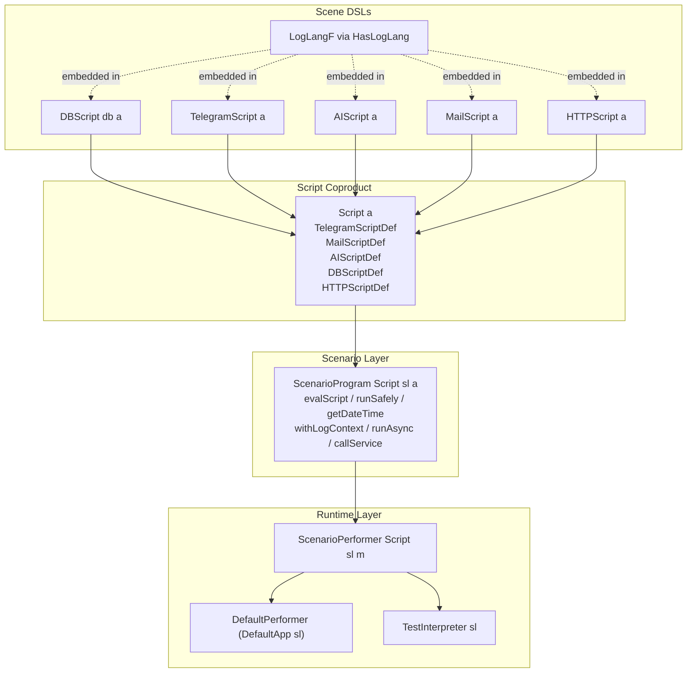

# Lazy Circus Reference: Scenarios

Read this when:

- writing or reviewing `ScenarioProgram`
- using `evalScript`, `throw`, `runSafely`, `getDateTime`, `withLogContext`, or `runAsync`
- reasoning about layer boundaries or overall architecture

## Contents

- Architecture Map
- Key Modules
- Writing Scenarios
- Using Log Context
- Using Extra Context And Feature Flags
- Using Async Work
- When To Use `runSafely`
- When To Use `runArbitraryIO`

## Architecture Map



## Key Modules

- `LazyCircus.Scenario`: scenario DSL and orchestration combinators
- `LazyCircus.Script`: coproduct of supported sub-languages
- `LazyCircus.Performer`: generic `ScenarioPerformer Script` dispatch
- `LazyCircus.Performer.Default`: production interpreter stack
- `LazyCircus.Testing.Performer`, `LazyCircus.Testing.TgTest`, `LazyCircus.Testing.Updates`, and the `LazyCircus.Testing.Bdd.*` layer: shipped in the separate `lazy-circus-testing` subpackage (`testing/`), not in the core library (see [testing.md](testing.md) and [bdd.md](bdd.md))
- `LazyCircus.Scene.DB`, `LazyCircus.Scene.Telegram`, `LazyCircus.Scene.AI`, `LazyCircus.Scene.Mail`, `LazyCircus.Scene.HTTP`: stable public facades that re-export scene APIs and logging helpers
- `LazyCircus.Scene.*.Lang`: each effect language
- `LazyCircus.Scene.*.Class`: each effect performer interface and runner

Important implementation details:

- each language runner uses `iterM`
- `ScenarioProgram`, `DBScript`, `TelegramScript`, `AIScript`, `MailScript`, and `HTTPScript` are Church-encoded free monads
- logging is embedded into each language functor via `HasLogLang`

## Writing Scenarios

`ScenarioProgram script serviceLib a` is the orchestration layer. Use it for business workflows that combine
multiple effects and control concerns.

### Core Operations

| Function | Purpose |
|---|---|
| `evalScript` | run one embedded `Script` |
| `throw` | raise an exception through the interpreter |
| `runSafely` | catch typed exceptions and return `Either` |
| `getDateTime` | get current UTC time |
| `log` / `logInfo` / `logWarn` / `logError` / `logSensitive` | scenario-level logging |
| `withLogContext` / `withLogEntry` / `with2LogEntries` | enrich logging context |
| `getExtraContext` / `readFromExtraContext` / `getFeatureFlag` | read runtime config |
| `runAsync` | schedule async work |
| `runArbitraryIO` | **fallback** escape hatch — run an arbitrary `IO` when no structured effect fits (see below) |
| `callService` | call a registered service via the service library |

Signatures (`sl` = `serviceLib`; module `LazyCircus.Scenario`):

```haskell
evalScript            :: script a -> ScenarioProgram script sl a
throw                 :: Exception e => e -> ScenarioProgram script sl a
runSafely             :: Exception e => ScenarioProgram script sl a -> ScenarioProgram script sl (Either e a)
getDateTime           :: ScenarioProgram script sl UTCTime
logInfo, logWarn, logError, logSensitive :: HasCallStack => Text -> ScenarioProgram script sl ()
withLogContext        :: [(Text, Text)] -> ScenarioProgram script sl a -> ScenarioProgram script sl a
withLogEntry          :: Show a => Text -> a -> ScenarioProgram script sl b -> ScenarioProgram script sl b
with2LogEntries       :: (Show a, Show b) => ((Text, a), (Text, b)) -> ScenarioProgram script sl z -> ScenarioProgram script sl z
getExtraContext       :: ScenarioProgram script sl (HashMap Text Text)
readFromExtraContext  :: Text -> ScenarioProgram script sl (Maybe Text)
getFeatureFlag        :: Text -> ScenarioProgram script sl Bool
runAsync              :: ScenarioProgram script sl () -> ScenarioProgram script sl ()
runArbitraryIO        :: IO a -> ScenarioProgram script sl a
callService           :: IsInServiceLib sl req resp => req -> ScenarioProgram script sl resp

run                   :: ScenarioPerformer script sl m => ScenarioProgram script sl a -> m a
```

Top-level `Script` wrappers (module `LazyCircus`):

```haskell
tgScript   :: Text -> TelegramScript b -> Script b
dbScript   :: PgDB db -> DbMode -> DBScript db b -> Script b
aiScript   :: AIScript b -> Script b
mailScript :: MailScript b -> Script b
httpScript :: BaseUrl -> HTTPScript b -> Script b
```

### Rule Of Thumb

- use `logInfo` and friends in `ScenarioProgram`
- use `slogInfo` and friends inside scene languages
- use `evalScript` at the boundary between orchestration and domain effect code

### Minimal Scenario Example

```haskell
import Control.Monad (void)
import LazyCircus (Script, aiScript, tgScript)
import LazyCircus.App.Service (NoServiceLib)
import LazyCircus.Scene.AI (ask)
import LazyCircus.Scene.Telegram (sendMessage)
import LazyCircus.Scenario
import RIO

myScenario :: ScenarioProgram Script NoServiceLib ()
myScenario = do
    logInfo "Starting scenario"

    result <-
        ( runSafely $ do
            answer <- evalScript $ aiScript $ ask myRequest
            case answer of
                Nothing ->
                    throw $ userError "AI returned nothing"
                Just request ->
                    void $ evalScript $ tgScript "demo-bot" $ sendMessage request
        ) :: ScenarioProgram Script NoServiceLib (Either SomeException ())

    case result of
        Left err ->
            logError $ "Scenario failed: " <> tshow err
        Right () ->
            logInfo "Scenario completed"
```

Assume `myRequest :: AIRequest SendMessageRequest`.

### Using Log Context

For logging principles (what to log, where to place logs, what not to log), see
[reference/logging.md](logging.md).

```haskell
processAct :: Int32 -> ScenarioProgram Script serviceLib ()
processAct actId =
    withLogEntry "act_id" actId $ do
        logInfo "Starting act processing"
        withLogContext [("stage", "validation")] $ do
            logInfo "Validating act"
```

### Using Extra Context And Feature Flags

```haskell
featureScenario :: ScenarioProgram Script serviceLib ()
featureScenario = do
    env <- readFromExtraContext "env"
    enabled <- getFeatureFlag "some_flag"
    logInfo $ "env=" <> tshow env
    when enabled $
        logInfo "Feature is enabled"
```

### Using Async Work

`runAsync` does not define how work is executed. It delegates to the active interpreter.

- in the default production runtime it is queued by `scheduleAsyncAction` into the shared action queue, then drained by the async worker loop — `runAsyncWorker` for a single worker, or `runAsyncWorkerPool n` for n competing workers over the same queue (n = 0 clamps to 1, n > 1024 to 1024, each with a warning; cancelling the caller thread stops all workers)
- in tests it is captured by default (`tcAsync = Mocked`) and not executed; with `tcAsync = Real` it is spawned on a background thread through the same test interpreter

```haskell
cleanupLater :: Int32 -> ScenarioProgram Script serviceLib ()
cleanupLater actId = do
    runAsync $ do
        logInfo "Background cleanup started"
        evalScript $ dbScript simpleDb ReadWrite $ delete (CircusActId actId)
        logInfo "Background cleanup finished"
```

### When To Use `runSafely`

Use `runSafely` only at boundaries where failure is expected and should be converted into data.

Good:

- wrapping an AI call that may fail
- isolating one optional notification branch
- converting DB or Telegram failure into a scenario decision

Avoid:

- wrapping the whole scenario by default
- swallowing errors without logging or handling them

### When To Use `runArbitraryIO`

`runArbitraryIO` is an **escape hatch / last resort**. It lifts a raw `IO a` into the
scenario and is intended only for one-off side effects that fit nowhere else.

Reach for it ONLY after ruling out:

- a scene language (`DB`, `Telegram`, `AI`, `Mail`, `HTTP`)
- a registered service (`callService`)
- a new scene language / service if the operation is worth keeping

Caveats:

- the `IO` runs for real in BOTH the production and the test interpreter — it
  cannot be mocked, captured, or asserted on the way Telegram/AI/Mail sends can
- it is invisible to `timedAndLog` automatic timing and to structured
  observability
- anything non-trivial run through it becomes a testing and maintenance burden

```haskell
-- Discouraged but available:
result <- runArbitraryIO someOneOffIO
```

If you find yourself using `runArbitraryIO` repeatedly for the same kind of
operation, that is a signal to promote it to a proper scene language or service.