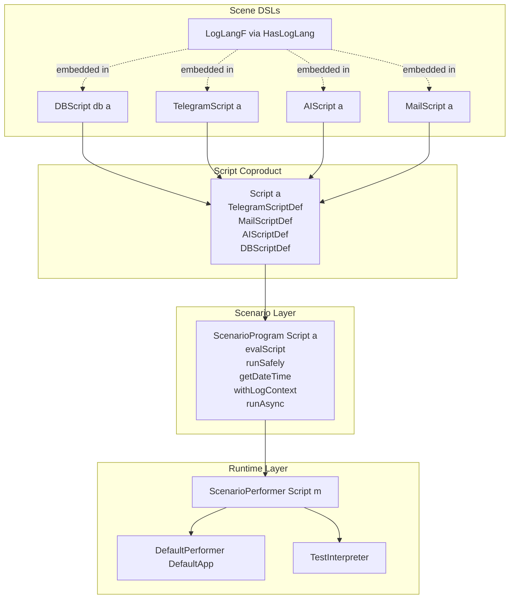

# Lazy Circus Reference: Scenarios

Read this when:

- writing or reviewing `ScenarioProgram`
- using `evalScript`, `throw`, `runSafely`, `getDateTime`, `withLogContext`, or `runAsync`
- reasoning about layer boundaries or overall architecture

## Architecture Map



## Key Modules

- `LazyCircus.Scenario`: scenario DSL and orchestration combinators
- `LazyCircus.Script`: coproduct of supported sub-languages
- `LazyCircus.Performer`: generic `ScenarioPerformer Script` dispatch
- `LazyCircus.Performer.Default`: production interpreter stack
- `LazyCircus.Testing.Performer`: mock-based test interpreter
- `LazyCircus.Scene.DB`, `LazyCircus.Scene.Telegram`, `LazyCircus.Scene.AI`, `LazyCircus.Scene.Mail`: stable public facades that re-export scene APIs and logging helpers
- `LazyCircus.Scene.*.Lang`: each effect language
- `LazyCircus.Scene.*.Class`: each effect performer interface and runner

Important implementation details:

- each language runner uses `iterM`
- `ScenarioProgram`, `DBScript`, `TelegramScript`, `AIScript`, and `MailScript` are Church-encoded free monads
- logging is embedded into each language functor via `HasLogLang`

## Writing Scenarios

`ScenarioProgram s a` is the orchestration layer. Use it for business workflows that combine
multiple effects and control concerns.

### Core Operations

| Function | Purpose |
|---|---|
| `evalScript` | run one embedded `Script` |
| `throw` | raise an exception through the interpreter |
| `runSafely` | catch typed exceptions and return `Either` |
| `getDateTime` | get current UTC time |
| `logInfo` / `logWarn` / `logError` / `logSensitive` | scenario-level logging |
| `withLogContext` / `withLogEntry` / `with2LogEntries` | enrich logging context |
| `getExtraContext` / `readFromExtraContext` / `getFeatureFlag` | read runtime config |
| `runAsync` | schedule async work |

### Rule Of Thumb

- use `logInfo` and friends in `ScenarioProgram`
- use `slogInfo` and friends inside scene languages
- use `evalScript` at the boundary between orchestration and domain effect code

### Minimal Scenario Example

```haskell
import Control.Monad (void)
import LazyCircus (Script, aiScript, tgScript)
import LazyCircus.Scene.AI (ask)
import LazyCircus.Scene.Telegram (sendMessage)
import LazyCircus.Scenario
import RIO

myScenario :: ScenarioProgram Script ()
myScenario = do
    logInfo "Starting scenario"

    result <-
        ( runSafely $ do
            answer <- evalScript $ aiScript $ ask myRequest
            case answer of
                Nothing ->
                    throw $ userError "AI returned nothing"
                Just request ->
                    void $ evalScript $ tgScript "demo-bot" $ sendMessage request
        ) :: ScenarioProgram Script (Either SomeException ())

    case result of
        Left err ->
            logError $ "Scenario failed: " <> tshow err
        Right () ->
            logInfo "Scenario completed"
```

Assume `myRequest :: AIRequest SendMessageRequest`.

### Using Log Context

```haskell
processAct :: Int32 -> ScenarioProgram Script ()
processAct actId =
    withLogEntry "act_id" actId $ do
        logInfo "Starting act processing"
        withLogContext [("stage", "validation")] $ do
            logInfo "Validating act"
```

### Using Extra Context And Feature Flags

```haskell
featureScenario :: ScenarioProgram Script ()
featureScenario = do
    env <- readFromExtraContext "env"
    enabled <- getFeatureFlag "some_flag"
    logInfo $ "env=" <> tshow env
    when enabled $
        logInfo "Feature is enabled"
```

### Using Async Work

`runAsync` does not define how work is executed. It delegates to the active interpreter.

- in the default production runtime it is queued by `scheduleAsyncAction`
- in tests it is captured in mocks and not executed

```haskell
cleanupLater :: Int32 -> ScenarioProgram Script ()
cleanupLater actId = do
    runAsync $ do
        logInfo "Background cleanup started"
        evalScript $ DBScriptDef simpleDb ReadWrite $ delete (CircusActId actId)
        logInfo "Background cleanup finished"
```

### When To Use `runSafely`

Use `runSafely` only at boundaries where failure is expected and should be converted into data.

Good:

- wrapping an AI call that may fail
- isolating one optional notification branch
- converting DB or Telegram failure into a scenario decision

Avoid:

- wrapping the whole scenario by default
- swallowing errors without logging or handling them